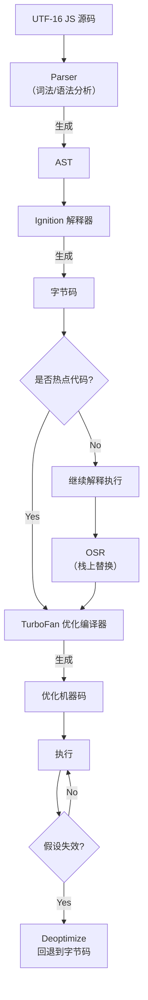

# mini-impl
用于学习，实现一些知名前端库的 mini源码(vite，vue 等等)

```mermaid
flowchart TD
    A[UTF-16 JS 源码] --> B[Parser<br>（词法/语法分析）]
    B -->|生成| C[AST]
    C --> D[Ignition 解释器]
    D -->|生成| E[字节码]
    E --> F{是否热点代码?}
    F -->|Yes| G[TurboFan 优化编译器]
    F -->|No| H[继续解释执行]
    G -->|生成| I[优化机器码]
    I --> J[执行]
    J --> K{假设失效?}
    K -->|Yes| L[Deoptimize<br>回退到字节码]
    K -->|No| J
    H --> M[OSR<br>（栈上替换）]
    M --> G

```