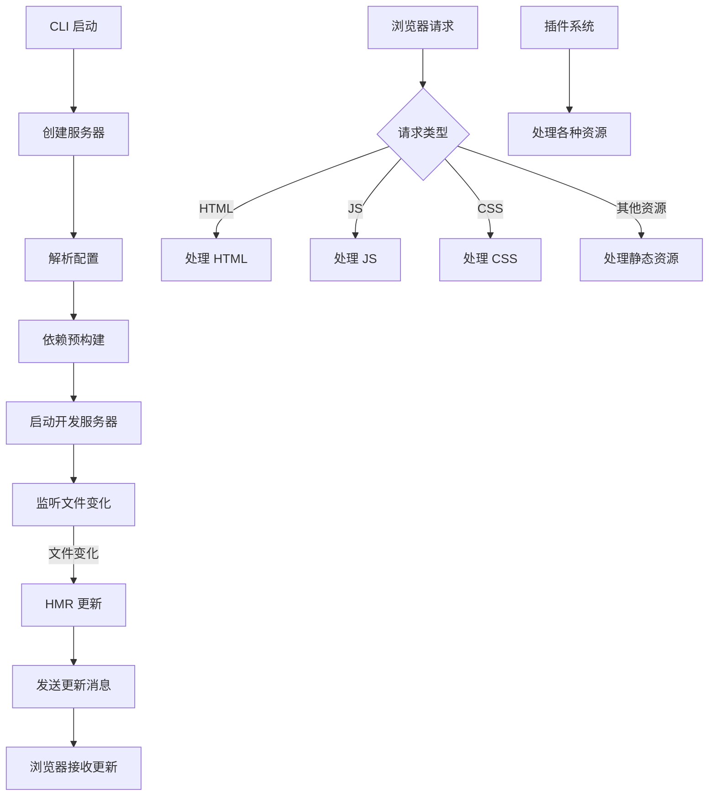

# mini-vite

一个简化版的 Vite 实现，用于学习和理解 Vite 的核心原理和工作机制。

## 总览

mini-vite 是一个模仿 Vite 核心功能的简化实现，旨在帮助开发者深入理解 Vite 的工作原理。它包含了 Vite 的核心特性，如：

- 开发服务器（Dev Server）
- 依赖预构建（Dependency Pre-Bundling）
- 插件机制（Plugin System）
- 模块热更新（HMR - Hot Module Replacement）
- No-bundle 服务（按需编译）

## 原理

Vite 利用浏览器原生 ES 模块导入功能，实现了快速的冷启动和即时的热更新。其核心原理包括：

1. **开发服务器**：基于 Connect 中间件的服务器，处理 HTTP 请求并提供静态资源。
2. **依赖预构建**：使用 Esbuild 对第三方依赖进行预构建，提高页面加载速度。
3. **按需编译**：仅在浏览器请求时编译所需的模块，避免打包整个应用。
4. **插件机制**：提供类似 Rollup 的插件 API，允许扩展构建过程。
5. **HMR 实现**：通过 WebSocket 实现模块热更新，提升开发体验。

### 架构流程图



## 开发计划

实现一个完整的 mini-vite 需要以下步骤：

### 1. 初始化项目和 CLI
- 设置项目结构
- 实现命令行接口
- 创建基本的服务器功能

### 2. 依赖预构建
- 使用 Esbuild 实现依赖预构建
- 处理 CommonJS 和 ES 模块转换

### 3. 插件机制
- 实现 PluginContainer 和 PluginContext
- 提供标准的插件 API

### 4. 资源编译构建
- 实现 JS、CSS、HTML 等资源的编译
- 支持模块解析和转换

### 5. HMR 模块热更新
- 实现 WebSocket 通信
- 监听文件变化并发送更新消息
- 浏览器端接收并应用更新

### 6. 完善和优化
- 错误处理和日志系统
- 性能优化
- 测试用例

## 使用方法

```bash
# 启动开发服务器
mini-vite serve

# 或者
mini-vite dev
```

## 目录结构

```
src/
├── node/           # Node.js 端实现
│   ├── cli.ts      # 命令行接口
│   ├── server/     # 服务器实现
│   ├── optimizer/  # 依赖预构建
│   ├── plugins/    # 插件系统
│   ├── hmr/        # 热更新实现
│   └── utils/      # 工具函数
└── client/         # 客户端 HMR 实现
```