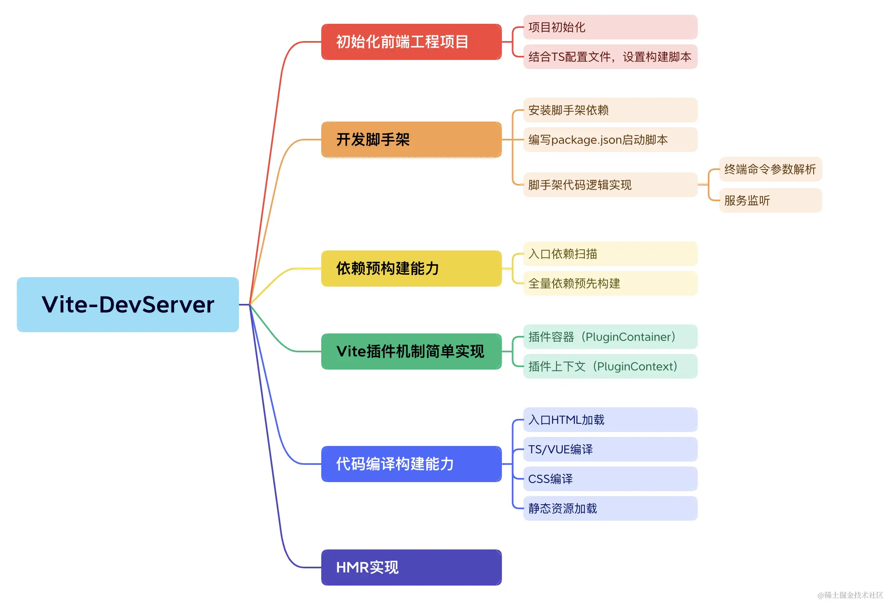
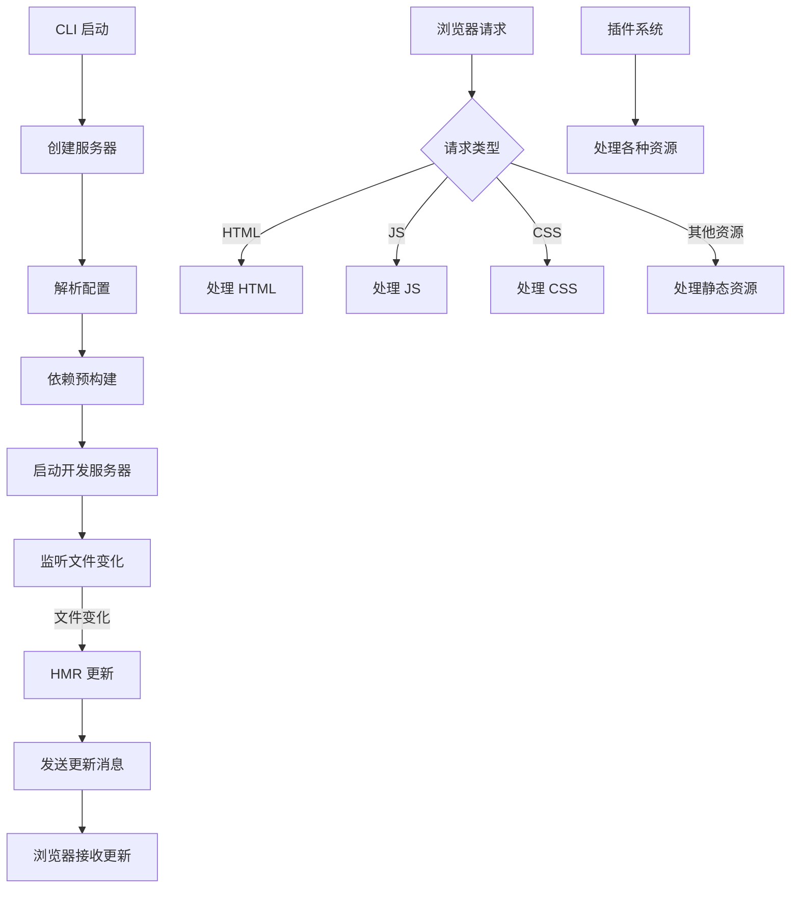
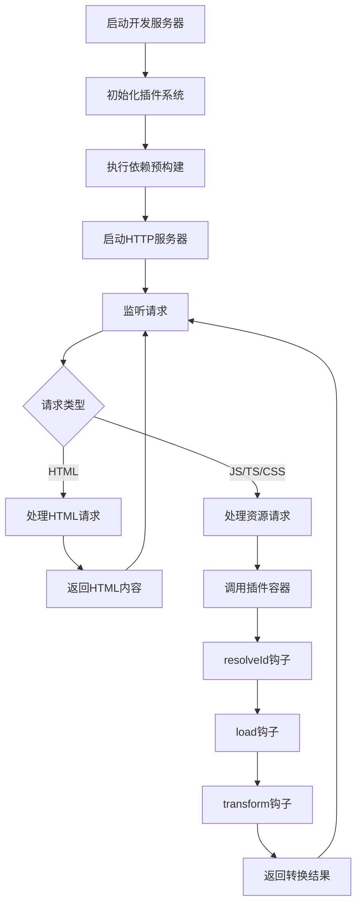

# mini-vite

一个简化版的 Vite 实现，用于学习和理解 Vite 的核心原理和工作机制。



## 总览

mini-vite 是一个模仿 Vite 核心功能的简化实现，旨在帮助开发者深入理解 Vite 的工作原理。它包含了 Vite 的核心特性，如：

- 开发服务器（Dev Server）
- 依赖预构建（Dependency Pre-Bundling）
- 插件机制（Plugin System）
- 模块热更新（HMR - Hot Module Replacement）
- No-bundle 服务（按需编译）

## 原理

### 架构流程图



### 1. 核心模块分析

#### 1.1 开发服务器 (server/index.ts)
- 使用 `connect` 框架作为 HTTP 服务器
- 集成多个中间件处理不同类型的请求
- 管理插件容器和插件生命周期
- 启动依赖预构建流程

#### 1.2 插件系统 (plugin.ts, server/pluginContainer.ts)
- 实现了类似 Rollup 的插件架构
- 支持 resolveId、load、transform 等核心钩子
- 插件容器负责按顺序调用插件钩子

#### 1.3 路径解析插件 (plugins/resolve.ts)
- 处理相对路径和绝对路径的模块解析
- 支持自动文件扩展名推断 (.ts, .js, .jsx, .tsx, .json)

#### 1.4 ESBuild 转换插件 (plugins/esbuild.ts)
- 使用 esbuild 将 TS/TSX/JSX 编译为浏览器可执行的 JS
- 提供源码映射支持
- 处理 CommonJS 和 ES 模块的转换

#### 1.5 导入分析插件 (plugins/importAnalysis.ts)
- 分析 ESM 导入语句
- 重写第三方依赖路径为预构建产物路径
- 处理相对路径和绝对路径的导入
- 支持 CommonJS 模块的导入分析

#### 1.6 CommonJS 兼容插件 (plugins/cjs.ts)
- 处理 CommonJS 模块与 ES 模块之间的互操作性
- 自动转换 `module.exports` 和 `exports.xx` 为 ES 模块导出
- 提供 `require()` 函数的浏览器兼容实现

### 2. 依赖预构建 (optimizer/index.ts)
- 扫描项目依赖项
- 使用 esbuild 预构建第三方依赖
- 生成预构建产物到 node_modules/.mini-vite/deps
- 处理 CommonJS 和 ES 模块转换

### 3. CommonJS 和 ES 模块转换

mini-vite 通过 esbuild 和自定义插件实现了 CommonJS (CJS) 和 ES 模块 (ESM) 的相互转换，以确保不同模块格式的代码可以在浏览器环境中正常运行。

#### 3.1 实现原理

模块转换主要在两个阶段进行：

1. **依赖预构建阶段**：在 `optimizer/index.ts` 中，使用 esbuild 对第三方依赖进行预构建。esbuild 会自动处理模块格式转换，将 CommonJS 模块转换为 ES 模块，以便在浏览器中使用。

2. **运行时转换阶段**：在 `plugins/esbuild.ts` 和 `plugins/cjs.ts` 中，对项目源代码进行实时转换。当浏览器请求一个模块时，mini-vite 会使用 esbuild 将其转换为浏览器可执行的 JavaScript 代码，并通过 cjs 插件提供 CommonJS 兼容性支持。

#### 3.2 模块格式识别

在 `plugins/esbuild.ts` 的 `transformWithEsbuild` 函数中，通过文件扩展名来识别模块格式：

- `.cjs` 和 `.mjs` 文件会被识别为 JavaScript
- `.cts` 和 `.mts` 文件会被识别为 TypeScript
- 其他文件根据扩展名确定 loader

#### 3.3 预构建中的模块处理

在 `optimizer/index.ts` 中，预构建过程使用 esbuild 的以下配置：

```javascript
{
  format: "esm",        // 输出格式为 ES 模块
  splitting: true,      // 启用代码分割
  bundle: true,         // 启用打包
}
```

这些配置确保了即使原始依赖是 CommonJS 格式，也会被转换为 ES 模块格式。

#### 3.4 运行时模块处理

在 `plugins/esbuild.ts` 中，运行时转换使用以下配置：

```javascript
{
  target: "esnext",     // 目标浏览器版本
  format: "esm",        // 输出格式为 ES 模块
  sourcemap: true,      // 生成源码映射
}
```

#### 3.5 依赖扫描

在 `optimizer/scanPlugin.ts` 中，通过 esbuild 插件扫描项目依赖。插件会识别裸模块导入（bare import），如 `import { foo } from 'bar'`，并将其添加到预构建依赖列表中。

#### 3.6 导入路径重写

在 `plugins/importAnalysis.ts` 中，分析模块导入语句并将第三方依赖的路径重写为预构建产物路径。例如：

```javascript
// 转换前
import { createApp } from 'vue'

// 转换后
import { createApp } from '/node_modules/.mini-vite/deps/vue.js'
```

这样确保了浏览器加载的是经过预构建和模块格式转换的版本。

#### 3.7 CommonJS 兼容性支持

为了支持在代码中使用 CommonJS 模块，mini-vite 提供了以下兼容性特性：

1. **导出转换**：在 `plugins/cjs.ts` 中，自动将 CommonJS 的 `module.exports` 和 `exports.xx` 转换为 ES 模块导出。
2. **require 函数支持**：提供了浏览器环境下的 `require()` 函数模拟实现，可以动态加载模块。
3. **混合模块支持**：同时支持 ES 模块和 CommonJS 模块在同一项目中使用。

示例：

```javascript
// CommonJS 模块
// math.js
exports.add = (a, b) => a + b;
exports.subtract = (a, b) => a - b;

// ES 模块中使用
// main.js
import { add } from './math.js'; // 自动转换 CommonJS 导出
const math = require('./math.js'); // require 函数支持
```

#### 1.7 请求转换 (transformRequest.ts)
- 协调插件容器的 resolveId、load、transform 钩子
- 实现完整的模块转换流程

#### 1.8 中间件
- indexHtmlMiddleware: 处理 HTML 请求
- transformMiddleware: 处理 JS/CSS 等资源请求

### 4. 工作流程

1. 启动开发服务器
2. 执行依赖预构建
3. 接收浏览器请求
4. 通过中间件处理请求
5. 调用插件容器进行模块转换
6. 返回转换后的结果

### 5. 流程图




## 使用方法

```bash
# 启动开发服务器
mini-vite serve

# 或者
mini-vite dev
```

## 目录结构

```
src                          
└─ node                      
   ├─ optimizer              
   │  ├─ index.ts            
   │  ├─ scanPlugin.ts       
   │  └─ types.ts            
   ├─ plugins                
   │  ├─ css.ts              
   │  ├─ cjs.ts              
   │  ├─ esbuild.ts          
   │  ├─ importAnalysis.ts   
   │  └─ resolve.ts          
   ├─ server                 
   │  ├─ middlewares         
   │  │  ├─ indexHtml.ts     
   │  │  └─ transform.ts     
   │  ├─ index.ts            
   │  └─ pluginContainer.ts  
   ├─ cli.ts                 
   ├─ constants.ts           
   ├─ plugin.ts              
   ├─ transformRequest.ts    
   ├─ tsconfig.json          
   └─ utils.ts               

```


## 开发计划

实现一个完整的 mini-vite 需要以下步骤：

### 1. 初始化项目和 CLI
- [x] 设置项目结构
- [x] 实现命令行接口
- [x] 创建基本的服务器功能

### 2. 依赖预构建
- [x] 使用 Esbuild 实现依赖预构建
- [x] 处理 CommonJS 和 ES 模块转换

### 3. 插件机制
- [x] 实现 PluginContainer 和 PluginContext
- [x] 提供标准的插件 API

### 4. 资源编译构建
- [x] 实现 JS、CSS、HTML 等资源的编译
- [x] 支持模块解析和转换

### 5. HMR 模块热更新
- [ ] 实现 WebSocket 通信
- [ ] 监听文件变化并发送更新消息
- [ ] 浏览器端接收并应用更新

### 6. 配置系统
- [ ] 实现配置文件解析 (vite.config.ts)
- [ ] 支持环境变量和模式
- [ ] 配置合并和验证

### 7. 构建与打包
- [ ] 实现生产环境构建
- [ ] 支持静态资源处理
- [ ] 代码分割和优化

### 8. 预览服务器
- [ ] 实现静态文件服务器用于预览构建结果

### 9. 完善和优化
- [ ] 错误处理和日志系统
- [ ] 性能优化
- [ ] 测试用例
