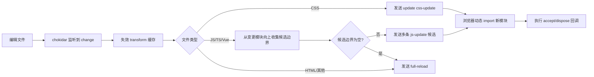

# mini-vite HMR 原理解析

本文基于当前 `mini-vite` 代码实现，系统说明热更新（HMR, Hot Module Replacement）是如何工作的、各模块职责是什么、更新是如何从文件变化传导到浏览器的，以及这套实现目前的边界与限制。

---

## 1. 设计目标

`mini-vite` 的 HMR 目标是：

- 编辑源码后，尽可能只替换受影响模块，而不是整页刷新。
- 保留页面运行时状态（例如组件局部状态、输入内容等）。
- 出错时给出可见反馈，并允许恢复。
- 无法安全热更新时，自动降级到 `full-reload`。

---

## 2. 关键角色与文件

### 2.1 服务端（Node）

- `src/node/server/hmr.ts`
  - 创建 WebSocket 服务端
  - 监听文件系统变化（`chokidar`）
  - 维护模块依赖图（`moduleGraph` + `importerGraph`）
  - 决策发 `update` 还是 `full-reload`

- `src/node/plugins/importAnalysis.ts`
  - 解析每个 JS 模块的 `import` 关系
  - 更新服务端模块图（给 HMR 用）
  - 给模块注入 `import.meta.hot`

- `src/node/server/middlewares/indexHtml.ts`
  - 注入 HMR 客户端脚本到 `index.html`

- `src/node/plugins/css.ts`
  - 把 CSS 转换为 JS 模块，以便走统一 HMR 通道

### 2.2 客户端（Browser）

- `src/client/client.ts`
  - 与服务端 WebSocket 建立连接
  - 接收 HMR 消息并执行更新
  - 实现 `import.meta.hot` API（`accept`/`dispose`/`decline` 等）
  - 处理错误遮罩与断线重连

---

## 3. 整体工作流



---

## 4. 启动阶段：HMR 如何被接入

### 4.1 注入客户端运行时代码

开发服务器响应 `index.html` 时，会插入：

```html
<script type="module">
  import "/node_modules/.mini-vite/client.js";
</script>
```

这段代码加载 `client.ts` 编译后的产物，负责建立 WebSocket 通道和运行时更新逻辑。

### 4.2 import 分析与热更新上下文注入

`importAnalysis` 插件在 transform 期间会给 JS 模块前面注入：

```js
import { createHotContext } from "/node_modules/.mini-vite/client.js";
const __hmr__ = createHotContext("<当前模块URL>");
import.meta.hot = __hmr__;
```

这一步让业务模块在开发环境可直接写：

```js
if (import.meta.hot) {
  import.meta.hot.accept(...)
}
```

同时，插件会把当前模块的 import 依赖上报给服务端 HMR 图。

---

## 5. 服务端核心机制

### 5.1 文件监听

`createHMRServer()` 内通过 `chokidar.watch()` 监听：

- `src/**/*`
- `*.html`
- `public/**/*`

并在变更时先调用 `invalidateTransformCache()`，确保后续请求拿到新编译结果。

### 5.2 模块图结构

服务端维护两张图：

- `moduleGraph: importer -> Set(importees)`
- `importerGraph: importee -> Set(importers)`

其中 `importAnalysis` 每次 transform 都会上报 importer 和 importees（即使 importees 为空，也会更新，用于清理旧依赖）。

### 5.3 候选边界计算

JS 变更时，服务端不再只算“单个边界”，而是从“变更模块 URL”出发，沿 `importerGraph` 向上做 BFS，收集整条导入链上的候选边界（包含变更模块本身）。

- 变更模块优先作为第一候选
- 持续向上加入 importer，直到没有上游
- 用 `visited` 去重，天然避免循环依赖导致的死循环

如果候选列表为空，服务端回退到 `full-reload`；否则发送一组 `js-update` 给客户端逐条尝试。

### 5.4 服务端消息协议

HMR 当前使用的主要消息：

- `connected`
- `update`
  - `updates: Array<{ type: 'js-update' | 'css-update', path, acceptedPath, timestamp }>`
- `full-reload`
- `error`

`js-update` 语义：

- `path`: 边界模块（由服务端计算）
- `acceptedPath`: 实际发生变化的模块
- `timestamp`: 防缓存用查询参数

`css-update` 语义：

- `path` 与 `acceptedPath` 一般相同（都是变化的 CSS 模块 URL）

---

## 6. 客户端核心机制

### 6.1 连接与消息分发

客户端通过：

```ts
new WebSocket(`${socketProtocol}://${socketHost}`, 'vite-hmr')
```

建立连接，按 `payload.type` 分发：

- `update`: 执行模块更新
- `full-reload`: 整页刷新
- `error`: 显示错误遮罩
- `prune`: 清理模块缓存（若服务端发送）

### 6.2 模块缓存与 HMR API

客户端维护 `moduleCache`，每个模块记录：

- `isSelfAccepting`
- `acceptDeps`
- `selfCallbacks`
- `depCallbacks`
- `disposers`
- `isDeclined`

`createHotContext(ownerPath)` 暴露 API：

- `accept()`
- `accept(callback)`
- `accept(dep, callback)`
- `accept(deps, callback)`
- `dispose(callback)`
- `decline()`
- `invalidate()`

其中：

- 自接收回调进入 `selfCallbacks`
- 依赖回调按依赖路径分桶存入 `depCallbacks`

### 6.3 JS 更新执行逻辑

收到 `update` 后，客户端会先拆分 JS/CSS 更新，然后对 JS 采用“多候选边界尝试”策略：

1. 逐条读取 `js-update`（`path` 为候选边界，`acceptedPath` 为实际变更模块）
2. 逐条校验边界是否可接受此更新
   - `boundary === acceptedPath` 时，需 `isSelfAccepting`
   - 否则需 `acceptDeps` 包含 `acceptedPath`
3. 对可接受项执行热替换
   - `acceptedPath + ?t=timestamp` 动态 `import()`
   - 先执行 `dispose` 清理旧副作用
   - 再按类型触发回调（`selfCallbacks` 或 `depCallbacks.get(acceptedPath)`）
4. 只要任意一条候选边界应用成功，就保留局部热更新结果
5. 如果所有 JS 候选都失败，才统一降级为整页刷新

### 6.4 CSS 更新执行逻辑

CSS 在服务端先被转为 JS 模块，模块顶层会将样式注入 `<style data-vite-dev-id="...">`。

当收到 `css-update`，客户端重新动态导入该 CSS 对应 JS 模块；模块顶层重新执行后，样式会被更新。

---

## 7. 为什么这套方案能工作

本质是三件事：

1. **编译期注入能力**：给模块注入 `import.meta.hot`
2. **运行时通知机制**：WebSocket 把“哪些模块变了”送到浏览器
3. **最小化替换执行**：动态 `import()` 新模块 + 触发注册回调

这三者串起来，就形成了从“保存文件”到“页面局部替换”的闭环。

---

## 8. 与整页刷新的关系

HMR 并不是“永远不刷新”，而是“能局部更新就局部更新，否则安全回退”。

会触发 `full-reload` 的典型场景：

- HTML 变化
- 非 JS/CSS 或未知类型变化
- 找不到可接受更新边界
- 运行时出现不可恢复错误

---

## 9. 当前实现边界与改进方向

当前实现已具备基础可用性，但仍有可演进空间：

- 更精细的模块图失效策略（例如改动/删除时的增量清理与 prune 联动）
- 更完整的 `accept(deps, cb)` 多依赖参数语义（目前按单依赖触发）
- 更完善的 `prune` 生命周期（服务端主动发送无效模块清理）
- 更丰富的错误恢复策略（比如编译恢复后自动移除 overlay 并局部重试）
- 更接近真实 Vite 的更新传播与失效策略

---

## 10. 一句话总结

`mini-vite` 的 HMR，本质上是：**服务端维护模块依赖关系并在文件变化时计算更新边界，客户端按消息动态拉取新模块并执行 `import.meta.hot` 回调，在保证安全的前提下优先局部替换，失败时回退整页刷新。**

