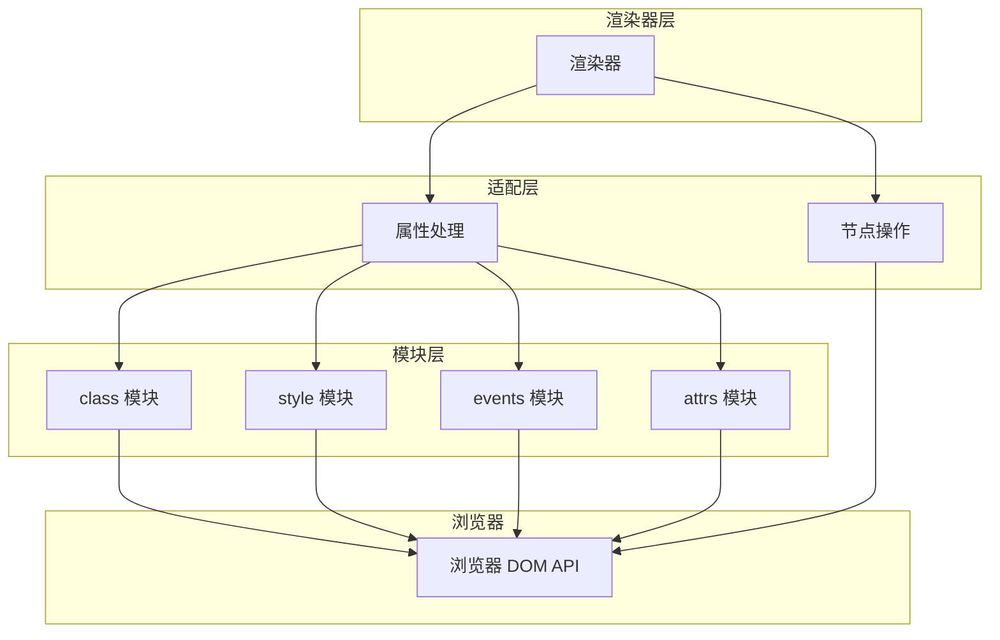
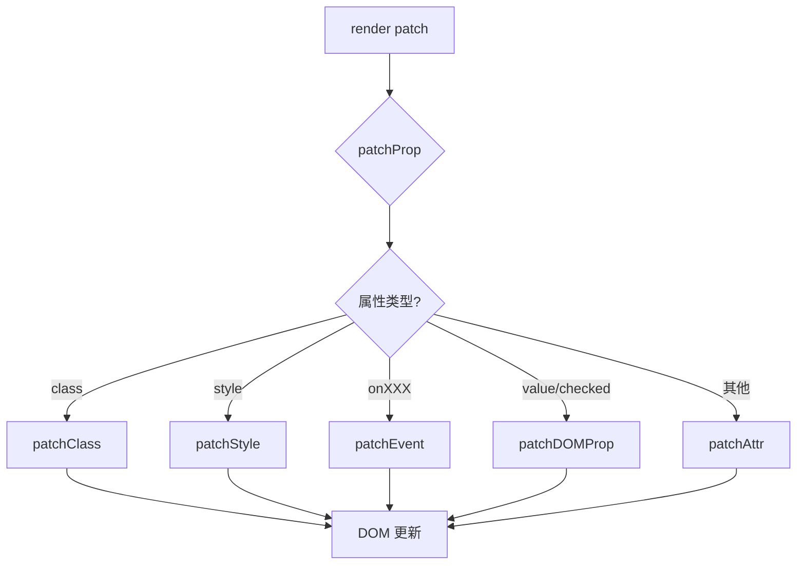

# DOM 适配层详解

DOM 适配层是 Vue 运行时与浏览器 DOM 之间的桥梁，负责将平台无关的渲染操作转换为具体的浏览器 DOM 操作。

## 架构设计



## 节点操作

### nodeOps

```typescript
// packages/runtime-dom/src/nodeOps.ts

export const nodeOps = {
  // 创建元素
  createElement(tag) {
    return document.createElement(tag)
  },

  // 创建 SVG 元素
  createElementNS(namespace, tag) {
    return document.createElementNS(namespace, tag)
  },

  // 创建文本节点
  createText(text) {
    return document.createTextNode(text)
  },

  // 创建注释节点
  createComment(text) {
    return document.createComment(text)
  },

  // 插入节点
  insert(child, parent, anchor = null) {
    if (anchor) {
      parent.insertBefore(child, anchor)
    } else {
      parent.appendChild(child)
    }
  },

  // 移除节点
  remove(child) {
    const parent = child.parentNode
    if (parent) {
      parent.removeChild(child)
    }
  },

  // 清空子节点
  removeAllChildren(parent) {
    if (parent.textContent) {
      parent.textContent = ''
    } else {
      while (parent.firstChild) {
        parent.removeChild(parent.firstChild)
      }
    }
  },

  // 设置元素文本
  setElementText(el, text) {
    el.textContent = text
  },

  // 设置文本节点
  setText(node, text) {
    node.nodeValue = text
  },

  // 获取父节点
  parentNode(node) {
    return node.parentNode
  },

  // 获取下一个兄弟节点
  nextSibling(node) {
    return node.nextSibling
  }
}
```

## 属性处理

### patchProp 主函数

```typescript
// packages/runtime-dom/src/patchProp.ts

export function patchProp(el, key, prevValue, nextValue) {
  if (key === 'class') {
    patchClass(el, nextValue)
  } else if (isOn(key)) {
    patchEvent(el, key, prevValue, nextValue)
  } else if (key === 'style') {
    patchStyle(el, prevValue, nextValue)
  } else if (shouldSetAsProp(el, key, nextValue)) {
    patchDOMProp(el, key, nextValue)
  } else {
    patchAttr(el, key, nextValue)
  }
}
```

## class 处理

### patchClass

```typescript
// packages/runtime-dom/src/modules/class.ts

export function patchClass(el, value) {
  if (value == null) {
    el.removeAttribute('class')
  } else {
    // 处理字符串、数组、对象
    const className = normalizeClass(value)
    el.className = className
  }
}

function normalizeClass(value) {
  let res = ''
  if (isString(value)) {
    res = value
  } else if (Array.isArray(value)) {
    for (let i = 0; i < value.length; i++) {
      res += normalizeClass(value[i]) + ' '
    }
  } else if (isObject(value)) {
    for (const name in value) {
      if (value[name]) {
        res += name + ' '
      }
    }
  }
  return res.trim()
}
```

## style 处理

### patchStyle

```typescript
// packages/runtime-dom/src/modules/style.ts

export function patchStyle(el, prevValue, nextValue) {
  const style = el.style

  if (!nextValue) {
    // 移除 style
    el.removeAttribute('style')
  } else if (isString(nextValue)) {
    // 字符串直接赋值
    style.cssText = nextValue
  } else {
    // 对象形式
    for (const key in nextValue) {
      style[key] = nextValue[key]
    }

    // 移除 prevValue 中不存在于 nextValue 的属性
    if (prevValue && !isString(prevValue)) {
      for (const key in prevValue) {
        if (!nextValue[key]) {
          style[key] = ''
        }
      }
    }
  }
}
```

## 事件处理

### patchEvent

```typescript
// packages/runtime-dom/src/modules/events.ts

export function patchEvent(el, eventName, prevValue, nextValue) {
  // 事件名转换 onClick -> click
  const event = eventName.slice(2).toLowerCase()

  // 移除旧事件
  if (prevValue) {
    el.removeEventListener(event, prevValue)
  }

  // 添加新事件
  if (nextValue) {
    el.addEventListener(event, nextValue)
  }
}
```

### 事件名规范化

```typescript
// Vue 自动处理不同的事件写法
// @click = v-on:click = onClick
```

## 属性处理

### patchAttr

```typescript
// packages/runtime-dom/src/modules/attrs.ts

export function patchAttr(el, key, value) {
  if (value == null) {
    el.removeAttribute(key)
  } else {
    el.setAttribute(key, value)
  }
}
```

### patchDOMProp

```typescript
// packages/runtime-dom/src/modules/props.ts

export function patchDOMProp(el, key, value) {
  if (key === 'value') {
    el.value = value
  } else if (key === 'checked') {
    el.checked = value
  } else if (key === 'innerHTML') {
    el.innerHTML = value
  } else {
    el[key] = value
  }
}
```

## DOM 适配器创建

### rendererOptions

```typescript
// packages/runtime-dom/src/index.ts

export const rendererOptions = extend({
  patchProp,
  insert: nodeOps.insert,
  remove: nodeOps.remove,
  createElement: nodeOps.createElement,
  createText: nodeOps.createText,
  createComment: nodeOps.createComment,
  setText: nodeOps.setText,
  setElementText: nodeOps.setElementText,
  parentNode: nodeOps.parentNode,
  nextSibling: nodeOps.nextSibling
}, nodeOps)
```

## 完整处理流程



## 特殊属性处理

### value 属性

```javascript
// input/select/textarea 特殊处理
const input = ref('text')
input.value = 'new value' // 直接设置 input.value
```

### checked 属性

```javascript
// checkbox/radio 特殊处理
const checked = ref(true)
checked.value = false // 直接设置 checkbox.checked
```

## 性能优化

### 1. 事件委托

```typescript
// Vue 3 使用事件委托优化
// 父元素监听，子元素触发
```

### 2. 样式合并

```javascript
// 样式对象合并，减少 CSS 操作
style = {
  color: 'red',
  fontSize: '14px'
}
```

### 3. 类名优化

```javascript
// 合并类名，减少 classList 操作
el.className = 'foo bar baz'
```

## 总结

DOM 适配层的核心设计：

1. **平台抽象**：将 DOM 操作封装为统一的 API
2. **模块化**：按功能划分为 class、style、events 等模块
3. **类型处理**：针对不同属性类型使用不同处理方式
4. **性能优化**：减少不必要的 DOM 操作
5. **兼容性**：处理不同浏览器的差异

这种设计使得 Vue 可以轻松扩展到其他平台（如 Weex、小程序等），只需实现对应的适配层即可。
