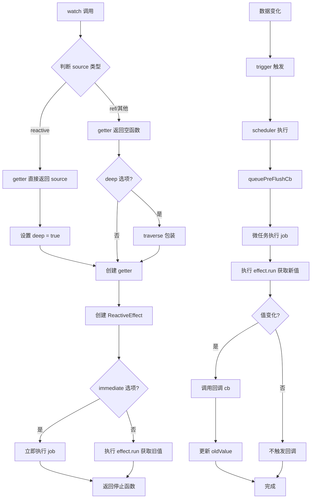

# Watch 监听器详解

`watch` 是 Vue 3 提供的监听响应式数据变化的 API，可以监听 reactive 对象、ref 或 getter 函数，并在数据变化时执行回调。

## 基本用法

### 监听 ref

```javascript
import { ref, watch } from 'mini-vue'

const count = ref(0)

watch(count, (newValue, oldValue) => {
  console.log(`count 变化: ${oldValue} -> ${newValue}`)
})

count.value++ // 触发回调
```

### 监听 reactive

```javascript
import { reactive, watch } from 'mini-vue'

const state = reactive({ name: '张三', age: 20 })

watch(state, (newValue, oldValue) => {
  console.log('state 变化:', newValue)
}, { deep: true })

state.name = '李四' // 触发回调
```

### 监听 getter

```javascript
import { reactive, watch } from 'mini-vue'

const state = reactive({ count: 0, name: 'test' })

// 监听计算值
watch(
  () => state.count * 2,
  (newValue) => {
    console.log('count 的两倍:', newValue)
  }
)
```

## watch 选项

```typescript
interface WatchOptions {
  immediate?: boolean  // 立即执行（创建时立即触发一次回调）
  deep?: boolean       // 深度监听（递归监听所有嵌套属性）
}
```

### immediate - 立即执行

```javascript
watch(count, (newValue, oldValue) => {
  console.log('立即执行')
}, { immediate: true })

// 创建 watch 时立即执行回调，oldValue 为 undefined
```

### deep - 深度监听

```javascript
const state = reactive({
  user: {
    name: '张三',
    age: 20
  }
})

watch(state, () => {
  console.log('state 变化')
}, { deep: true })

state.user.name = '李四' // 即使是深层属性变化也会触发
```

## 实现原理

### 核心代码结构

```typescript
// packages/runtime-core/src/apiWatch.ts

export function watch(source, cb: Function, options?: WatchOptions) {
  return doWatch(source as any, cb, options)
}

function doWatch(
  source,
  cb: Function,
  { immediate, deep }: WatchOptions = {}
) {
  let getter: () => any

  // 处理不同的 source 类型
  if (isReactive(source)) {
    // reactive 对象
    getter = () => source
    deep = true
  } else {
    // ref 或其他
    getter = () => {}
  }

  // 处理 deep 选项
  if (cb && deep) {
    const baseGetter = getter
    getter = () => traverse(baseGetter())
  }

  let oldValue = {}
  const job = () => {
    if (cb) {
      const newValue = effect.run()
      if (deep || hasChanged(newValue, oldValue)) {
        cb(newValue, oldValue)
        oldValue = newValue
      }
    }
  }

  // 调度器
  let scheduler = () => queuePreFlushCb(job)

  const effect = new ReactiveEffect(getter, scheduler)

  if (cb) {
    if (immediate) {
      job()
    } else {
      oldValue = effect.run()
    }
  } else {
    effect.run()
  }

  return () => {
    effect.stop()
  }
}
```

### traverse - 深度遍历

```typescript
// 递归访问对象所有属性，触发依赖收集
export function traverse(value: unknown, seen?: Set<unknown>) {
  // 非对象类型直接返回
  if (!isObject(value)) {
    return value
  }

  // 防止循环引用
  seen = seen || new Set()
  if (seen.has(value)) {
    return value
  }

  seen.add(value)

  // 数组遍历
  if (Array.isArray(value)) {
    for (let i = 0; i < value.length; i++) {
      traverse(value[i], seen)
    }
  }
  // Map 遍历
  else if (value instanceof Map) {
    value.forEach((val, key) => {
      traverse(key, seen)
      traverse(val, seen)
    })
  }
  // Set 遍历
  else if (value instanceof Set) {
    value.forEach(val => traverse(val, seen))
  }
  // 对象遍历
  else {
    for (const key in value as object) {
      traverse((value as any)[key], seen)
    }
  }

  return value
}
```

## 工作流程



## 监听多种数据源

### 监听数组

```javascript
import { ref, watch } from 'mini-vue'

const count = ref(0)
const name = ref('张三')

// 监听多个源
watch(
  [count, name],
  ([newCount, newName], [oldCount, oldName]) => {
    console.log(`count: ${oldCount} -> ${newCount}`)
    console.log(`name: ${oldName} -> ${newName}`)
  }
)
```

## 停止监听

```javascript
const count = ref(0)

const stop = watch(count, (newValue) => {
  console.log('count:', newValue)
})

// 手动停止监听
stop()
```

## 与 computed 的区别

| 特性 | computed | watch |
|------|----------|-------|
| 用途 | 计算新值 | 执行副作用 |
| 返回值 | 返回值作为响应式数据 | 执行回调函数 |
| 缓存 | 有缓存，依赖不变不重算 | 每次变化都执行 |
| 适用场景 | 基于响应式数据的计算 | 响应式数据变化时执行逻辑 |

### computed 示例

```javascript
const count = ref(0)
const double = computed(() => count.value * 2)
// double 是响应式的，可以直接使用
```

### watch 示例

```javascript
const count = ref(0)

watch(count, (newValue) => {
  console.log('count 变化了')
  // 执行副作用逻辑
})
```

## 常见使用场景

### 1. 异步数据获取

```javascript
const id = ref(1)

watch(id, async (newId) => {
  const data = await fetch(`/api/${newId}`)
  // 处理数据
}, { immediate: true })
```

### 2. 表单验证

```javascript
const form = reactive({
  email: '',
  password: ''
})

watch(form, (newForm) => {
  validateForm(newForm)
}, { deep: true })
```

### 3. 组件通信

```javascript
const props = defineProps(['id'])

// 监听 props 变化
watch(() => props.id, (newId) => {
  // 处理 props 变化
})
```

## 总结

watch API 的实现要点：

1. **数据源处理**：支持 reactive、ref、getter 三种数据源
2. **深度监听**：通过 traverse 函数递归访问所有嵌套属性
3. **依赖收集**：使用 ReactiveEffect 收集数据依赖
4. **调度执行**：通过调度器异步执行回调
5. **值比较**：使用 hasChanged 比较新旧值
6. **立即执行**：支持 immediate 选项创建时立即触发
7. **停止监听**：返回停止函数可手动取消监听
