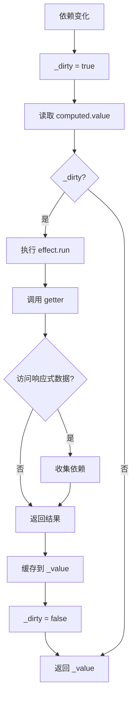

# computed 计算属性详解

`computed` 是 Vue 3 响应式系统的重要组成部分，用于创建基于响应式数据的计算属性。计算属性具有缓存特性，只有当依赖的响应式数据变化时才会重新计算。

## 基本用法

### 基础示例

```javascript
import { reactive, computed } from 'mini-vue'

const state = reactive({
  count: 1,
  double: computed(() => state.count * 2)
})

console.log(state.double) // 2

state.count++
console.log(state.double) // 4 - 自动更新
```

### getter 和 setter

```javascript
const count = ref(1)
const computedObj = computed({
  get: () => count.value * 2,
  set: (val) => { count.value = val / 2 }
})

console.log(computedObj.value) // 2

computedObj.value = 10
console.log(count.value) // 5
```

## 实现原理

### ComputedRefImpl 类

```typescript
// packages/reactivity/src/computed.ts

export class ComputedRefImpl<T> {
  // 计算属性依赖的 effect
  public effect: ReactiveEffect<T>

  // 是否脏（需要重新计算）
  private _dirty: boolean = true

  // 缓存的计算值
  private _value: T

  // 是否为 ref
  public readonly __v_isRef = true

  constructor(getter, public setter) {
    // 创建 ReactiveEffect，传入 getter 和调度器
    this.effect = new ReactiveEffect(
      () => {
        // 清理依赖收集
        this._dirty = true
      },
      () => {
        // 调度器：将 _dirty 设为 true 并触发更新
        this._dirty = true
        triggerRefValue(this)
      }
    )

    // 标记为计算属性
    this.effect.computed = this
  }

  get value() {
    // 1. 收集依赖
    trackRefValue(this)

    // 2. 如果是脏的，重新计算
    if (this._dirty) {
      this._dirty = false
      this._value = this.effect.run()
    }

    return this._value
  }

  set value(newValue) {
    this.setter(newValue)
  }
}
```

## 缓存机制

计算属性的核心特性是**缓存**，只有当依赖变化时才重新计算：



## 计算属性嵌套

```javascript
const count = ref(1)
const double = computed(() => count.value * 2)
const quadruple = computed(() => double.value * 2)

console.log(quadruple.value) // 4

count.value = 2
console.log(quadruple.value) // 8 - 自动更新
```

## 依赖追踪

### 1. 读取值时收集依赖

```typescript
get value() {
  // 收集当前 computed 到依赖
  trackRefValue(this)

  // 计算新值（执行 getter，会触发响应式数据的 get）
  if (this._dirty) {
    this._dirty = false
    this._value = this.effect.run()
  }

  return this._value
}
```

### 2. 依赖变化时标记脏

```typescript
// 依赖变化时触发
triggerEffects(dep) {
  const effects = [...dep]

  // 先触发计算属性的 effect
  for (const effect of effects) {
    if (effect.computed) {
      triggerEffect(effect)
    }
  }

  // 再触发其他 effect
  for (const effect of effects) {
    if (!effect.computed) {
      triggerEffect(effect)
    }
  }
}
```

### 3. 调度器更新脏状态

```typescript
this.effect = new ReactiveEffect(
  () => {
    // getter 执行时清理依赖
    this._dirty = true
  },
  () => {
    // 调度器执行
    this._dirty = true
    triggerRefValue(this)
  }
)
```

## 与普通 effect 的区别

| 特性 | computed | effect |
|------|----------|--------|
| 缓存 | 有缓存 | 无缓存 |
| 执行时机 | 懒执行 | 立即执行 |
| 调度 | 有 scheduler | 可选 scheduler |
| 依赖收集 | 只读一次 | 每次执行 |

### 执行顺序

```javascript
const count = ref(1)
const double = computed(() => count.value * 2)

effect(() => {
  console.log('effect:', double.value)
})

// 1. effect 立即执行，收集依赖
// 2. 读取 double.value，触发 count 依赖收集
// 3. count 变化时，先触发 double 的 scheduler
// 4. double._dirty = true
// 5. 触发 effect 重新执行
```

## 源码解析

### 完整实现

```typescript
// packages/reactivity/src/computed.ts

export function computed(getterOrOptions) {
  let getter
  let setter

  // 处理参数
  if (isFunction(getterOrOptions)) {
    getter = getterOrOptions
    setter = () => {
      console.warn('computed 必须是只读的')
    }
  } else {
    getter = getterOrOptions.get
    setter = getterOrOptions.set
  }

  // 创建 ComputedRefImpl 实例
  return new ComputedRefImpl(getter, setter)
}

export class ComputedRefImpl<T> {
  private _value: T
  private _dirty: boolean = true
  public readonly effect: ReactiveEffect<T>

  constructor(
    public getter: () => T,
    public readonly setter: (value: T) => void
  ) {
    this.effect = new ReactiveEffect(
      () => {
        this._dirty = true
      },
      () => {
        this._dirty = true
        triggerRefValue(this)
      }
    )
    this.effect.computed = this
  }

  get value() {
    trackRefValue(this)

    if (this._dirty) {
      this._dirty = false
      this._value = this.effect.run()
    }

    return this._value
  }

  set value(newValue) {
    this.setter(newValue)
  }
}
```

## 常见使用场景

### 1. 派生状态

```javascript
const firstName = ref('张')
const lastName = ref('三')

const fullName = computed(() => {
  return firstName.value + lastName.value
})
```

### 2. 过滤/排序

```javascript
const items = ref([3, 1, 2])

const sortedItems = computed(() => {
  return [...items.value].sort((a, b) => a - b)
})
```

### 3. 复杂计算

```javascript
const products = ref([
  { price: 100, quantity: 2 },
  { price: 50, quantity: 3 }
])

const total = computed(() => {
  return products.value.reduce((sum, p) => {
    return sum + p.price * p.quantity
  }, 0)
})
```

## 总结

computed 的核心设计：

1. **缓存机制**：通过 `_dirty` 标记控制是否重新计算
2. **依赖追踪**：读取值时自动收集依赖
3. **懒执行**：只在首次访问时计算
4. **调度更新**：依赖变化时通过 scheduler 触发更新
5. **响应式**：返回的对象也是响应式的，可以直接在模板中使用
