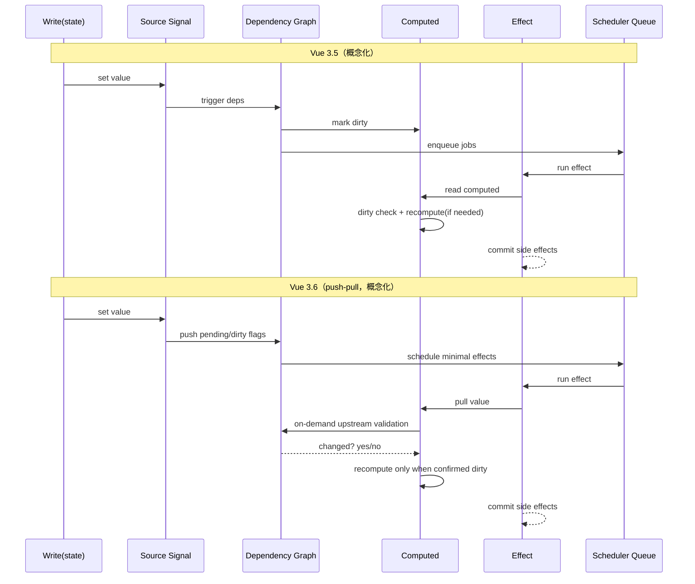

# Vue 3.6 相对 3.5 升级总结（聚焦响应式）

> 说明：截至目前，Vue 3.6 仍处于 beta 阶段（`3.6.0-beta.x`），以下内容基于 `vuejs/core` 的 `minor` 分支 changelog 汇总。

## 1) 3.6 相对 3.5 的主要升级点

### A. Vapor Mode 进入 beta，功能集基本齐备
- 3.6 的核心新增是 **Vapor Mode**（可选编译/运行模式）进入 beta，目标是降低基线包体并提升运行性能。
- 在组件能力上已接近 VDOM 模式的稳定特性（仍有边界限制，例如纯 Vapor 模式下对 Suspense 的限制、混合嵌套场景仍在持续打磨）。

### B. `@vue/reactivity` 进行一次“大重构”
- 3.6 在官方说明中明确提到：响应式系统基于 **alien-signals** 思路重构。
- 目标非常直接：**更高性能 + 更低内存占用**，并减少依赖追踪/触发链路中的额外开销。

### C. 围绕新模式与核心运行时的大量稳定性修复
- 3.6 beta 的后续版本集中修复了 KeepAlive、Teleport、templateRef、Transition、slots 等边界行为。
- 这类修复本质上是在“新渲染模式 + 旧生态互操作”阶段，把一致性和可预测性补齐。

---

## 2) Vapor Mode 实现原理（为什么它更快）

> 关键词：**编译期前移**、**细粒度更新**、**减少 VDOM 中间层**。

### 2.1 本质定位：Vue 的“高性能子集”
- Vapor 不是替代 Vue，而是 Vue 在 SFC 场景下的一种 **可选编译模式**。
- 它把一部分原本在运行时（VDOM diff）做的工作，提前到编译期完成。
- 结果是：运行时少做“通用推断”，更多做“定向更新”。

### 2.2 编译阶段做了什么
- 在 `template` 编译时，把节点结构、动态绑定、依赖关系转成更“直接”的更新逻辑。
- 对稳定结构做静态化，对动态片段做可定位更新点（可以理解为更细颗粒度的更新单元）。
- 在事件、slots、指令、动态组件等场景生成 Vapor 专用代码路径（3.6 beta 中持续补齐）。

### 2.3 运行时阶段怎么执行
- 传统 VDOM：状态变化 -> 重新执行 render -> 产出新 VNode -> diff -> patch。
- Vapor 路径：状态变化 -> 命中编译期建立的更新点 -> 直接更新对应 DOM/片段。
- 核心收益是减少“重新创建中间对象 + 全树比较”的开销。

### 2.4 为什么包体会更小
- 使用 `createVaporApp` 时，可避免引入整套 VDOM 运行时代码路径。
- 如果在 `createApp` 中启用 `vaporInteropPlugin`，可混用 VDOM 与 Vapor，但会引入互操作成本并部分抵消包体收益。

### 2.5 目前的边界与工程策略
- 3.6 beta 已达到“功能集基本齐备”，但互操作边界（尤其复杂组件库场景）仍在持续打磨。
- 实践上建议：先按页面/子域分区试点，减少 Vapor 与 VDOM 深度交错嵌套。

---

## 3) alien-signals 实现原理（Vue 3.6 响应式重构基础思路）

> 关键词：**push-pull 混合传播**、**依赖图最短路径更新**、**低分配低回收压力**。

### 3.1 核心模型：Signal / Computed / Effect
- `signal`：可变源节点（状态源）。
- `computed`：派生节点（有缓存、按需重算）。
- `effect`：副作用节点（消费依赖并在变更时调度执行）。
- 它们通过依赖图链接：谁读取谁，就建立“订阅关系”。

### 3.2 push-pull 混合算法（为什么叫 push-pull）
- **push 阶段**：源数据变化时，先把下游节点标记为“可能脏”（pending/dirty），快速传播“状态失效信号”。
- **pull 阶段**：真正读取 `computed` 或执行 effect 前，再按需检查依赖是否真的变了，必要时重算。
- 好处：避免“每次写都全量重算”，把真实计算成本延迟到“需要值”的那一刻。

### 3.3 脏标记与调度的关键点
- 不是暴力递归全图重跑，而是用状态位 + 链式关系做定向传播。
- 仅在必要时进入深层检查，减少无效重算与重复遍历。
- 对嵌套 effect、scope 回收等场景提供更稳的生命周期处理，降低悬挂依赖风险。

### 3.4 内存优化思路
- 官方与 alien-signals 资料都强调：算法核心尽量减少复杂容器与额外分配。
- 目标是让依赖关系维护更轻，降低长期运行下 GC 压力与内存峰值波动。
- 这也是 3.6 在“高频更新 + 长时运行”场景更稳定的底层原因之一。

### 3.5 与 Vue 3.5 的关系
- 3.5 已在响应式上做过明显优化，但 3.6 是进一步“算法级重排”。
- 对业务 API（`ref/reactive/computed/watch`）通常无感；变化主要体现在性能与资源占用曲线。

---

## 4) Vapor 与 alien-signals 如何配合

- Vapor 解决“渲染路径”问题：减少 VDOM 中间步骤，让更新更直达。
- alien-signals 思路解决“响应式路径”问题：让依赖传播与重算更高效。
- 两者叠加后，形成 3.6 的核心性能画像：  
  **更快发现需要更新的地方 + 更快把更新落到真实 DOM**。

---

## 5) 3.5 vs 3.6 响应式执行链路对比图

### 5.1 文字链路图（总览）

**Vue 3.5（简化视角）**

```text
state write
  -> 触发 dep 集合
  -> 标记相关 computed/effect dirty
  -> 调度队列（job queue）
  -> 读取 computed 时做脏检查并可能重算
  -> 执行 effect / 组件更新
```

**Vue 3.6（alien-signals 思路，简化视角）**

```text
state write
  -> push: 沿依赖图快速传播 pending/dirty（先传播失效信号）
  -> scheduler: 仅调度真正需要执行的 effect
  -> pull: 在读取 computed / 执行 effect 前按需校验上游是否真变
  -> 仅对“确认脏”的节点重算
  -> 提交副作用 / 组件更新
```

### 5.2 Mermaid 时序图（可直接放支持 Mermaid 的文档系统）



### 5.3 一句话读图结论
- 3.5 和 3.6 都有“脏标记 + 调度 + 按需计算”思想。
- 3.6 的关键差异是把 **push（失效传播）** 与 **pull（读取时校验）** 结合得更彻底，目标是减少无效遍历、无效重算和额外内存维护成本。

---

## 6) 参考来源

- Vue 3.6 预发布变更（minor changelog）  
  https://github.com/vuejs/core/blob/minor/CHANGELOG.md
- Vapor Roadmap（官方 issue）  
  https://github.com/vuejs/core/issues/13687
- alien-signals README（算法与设计说明）  
  https://github.com/stackblitz/alien-signals