# 响应式系统（reactivity）

`reactivity` 模块实现了 mini-vue 的响应式系统，核心思想是通过依赖收集和触发机制，实现数据的自动追踪和更新。

## 主要 API

- `reactive(obj)`：将对象转为响应式对象。
- `ref(value)`：创建一个响应式的基本类型或对象引用。
- `computed(getter)`：创建一个基于响应式依赖的计算属性。
- `effect(fn)`：注册副作用函数，自动追踪依赖并在依赖变更时重新执行。

## 实现原理

- 依赖收集：通过 Proxy 拦截对象的 get/set 操作，在读取时收集依赖，在设置时触发依赖。
- 响应式引用：`ref` 和 `computed` 通过内部的依赖管理机制实现自动更新。
- 副作用调度：`effect` 支持嵌套、调度和清理。

### computed

#### 计算属性流程图
> packages/vue/examples/reactivity/computed.html

```mermaid
flowchart TD
    A[开始] --> B["从Vue中解构 reactive, computed, effect"]
    
    subgraph 创建响应式对象
        B --> C1["调用 reactive({name: '张三'})"]
        C1 --> C2["执行 createReactiveObject()"]
        C2 --> C3["创建 Proxy 对象并设置 baseHandlers"]
        C3 --> C4["代理对象增加 IS_REACTIVE 标记"]
        C4 --> C5["返回响应式对象 obj"]
    end
    
    subgraph 创建计算属性
        C5 --> D1["调用 computed(() => '姓名：' + obj.name)"]
        D1 --> D2["创建 ComputedRefImpl 实例"]
        D2 --> D3["创建 ReactiveEffect 实例并传入 getter 和 scheduler"]
        D3 --> D4["返回计算属性对象 computedObj"]
    end
    
    subgraph 创建副作用函数
        D4 --> E1["调用 effect(() => document.querySelector('#app').innerHTML = computedObj.value)"]
        E1 --> E2["创建 ReactiveEffect 实例"]
        E2 --> E3["执行 run() 方法"]
        E3 --> E4["设置 activeEffect 为当前 effect"]
        E4 --> E5["执行传入的函数"]
    end
    
    subgraph 读取计算属性值
        E5 --> F1["访问 computedObj.value"]
        F1 --> F2["调用 trackRefValue(computedObj)"]
        F2 --> F3["将当前 effect 添加到 computedObj.dep 中"]
        F3 --> F4["检查 _dirty 状态"]
        F4 --> F5["执行 computedObj.effect.run()"]
        F5 --> F6["访问 obj.name"]
    end
    
    subgraph 读取响应式数据
        F6 --> G1["触发 Proxy 的 get 处理器"]
        G1 --> G2["调用 track(target, 'name')"]
        G2 --> G3["将计算属性的 effect 添加到 targetMap 中"]
        G3 --> G4["返回 obj.name 的值"]
        G4 --> G5["计算属性返回结果"]
        G5 --> G6["更新 DOM 内容"]
    end
    
    subgraph 数据变更
        G6 --> H1["2秒后执行 obj.name = '李四'"]
        H1 --> H2["触发 Proxy 的 set 处理器"]
        H2 --> H3["调用 trigger(target, 'name')"]
        H3 --> H4["获取该属性的所有依赖(effect)"]
        H4 --> H5["调用 triggerEffects(dep)"]
    end
    
    subgraph 触发更新
        H5 --> I1["触发计算属性的 effect scheduler"]
        I1 --> I2["将计算属性的 _dirty 设为 true"]
        I2 --> I3["触发 triggerRefValue(computedObj)"]
        I3 --> I4["触发渲染 effect"]
        I4 --> I5["重新读取 computedObj.value"]
        I5 --> I6["重新计算值"]
        I6 --> I7["更新 DOM 显示新的值"]
    end
    
    I7 --> J[结束]
```


##### targetMap属性
```ts
// targetMap结构示例 - 从界面调试工具截图转换
const targetMap = WeakMap({
  // 响应式对象
  Object => Map(1) {
    // 属性 => 依赖集合
    key: "name",
    name: "张三",
    __v_isReactive: true,
    [[Prototype]]: Object,
    
    // 属性的依赖收集
    value: Map(1) {
      // 属性名 => 依赖集合
      "name" => Set(1) {
        // 依赖效果
        ReactiveEffect {
          value: ReactiveEffect,
          computed: ComputedRefImpl {
            dep: Set(1) {
              // 嵌套的依赖关系
              ReactiveEffect {
                value: ReactiveEffect,
                fn: () => { /* ... */ },
                scheduler: null,
                [[Prototype]]: Object
              }
            },
            size: 1,
            [[Prototype]]: Set,
            effect: ReactiveEffect {
              computed: ComputedRefImpl,
              fn: f,
              scheduler: f
            },
            __v_isRef: true,
            _dirty: false,
            _value: "姓名: 张三",
            value: () => { return '姓名: ' + obj.name }
          }
        }
      }
    },
    size: 1,
    [[Prototype]]: Map
  }
})
```

这个结构展示了Vue 3响应式系统的内部工作原理：

1. **WeakMap保存所有响应式对象**：targetMap使用WeakMap，以响应式对象为键
2. **Map保存属性与依赖的关系**：每个响应式对象对应一个Map，记录该对象各属性的依赖
3. **Set存储依赖**：每个属性对应一个Set，包含依赖该属性的所有副作用函数
4. **嵌套依赖关系**：计算属性也会成为其他effect的依赖，形成嵌套的依赖树

从截图中可以看出：
- 有一个响应式对象，name属性值为"张三"
- 存在一个计算属性依赖于这个name属性
- 计算属性的_dirty标志为false，表示当前值是最新的
- 计算属性又成为了另一个ReactiveEffect的依赖

## 示例

```js
import { reactive, ref, computed, effect } from 'mini-vue/reactivity'

const state = reactive({ count: 0 })
const double = computed(() => state.count * 2)

effect(() => {
  console.log('count:', state.count, 'double:', double.value)
})

state.count++ // 自动触发 effect
```

更多示例可参考 `packages/vue/src/examples/reactivity/` 目录。 