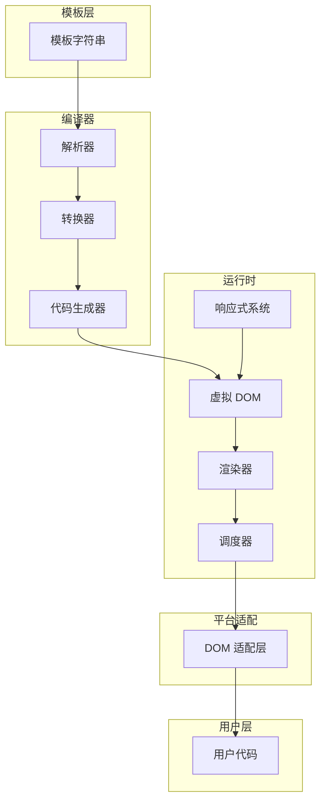

# mini-vue 项目总览

mini-vue 是一个简化版的 Vue 3 框架实现，旨在帮助开发者理解 Vue 的核心原理。项目采用 monorepo 结构，主要包含以下核心模块：

- **compiler-core**：模板编译的核心逻辑，包括 AST 解析、转换、代码生成等。
- **compiler-dom**：针对 DOM 平台的编译适配。
- **reactivity**：响应式系统的实现，包含 reactive、ref、computed、effect 等。
- **runtime-core**：运行时核心，包含虚拟 DOM、组件系统、渲染器等。
- **runtime-dom**：运行时 DOM 适配层，负责操作真实 DOM。
- **shared**：工具函数和类型定义，供各模块共享。
- **vue**：对外暴露的 API 入口及示例。
- **vue-compat**：Vue 2 兼容层。

每个模块均有独立的源码目录，便于理解和维护。

## 项目目录结构

```
mini-vue/
├── packages/
│   ├── reactivity/           # 响应式系统
│   │   └── src/
│   │       ├── index.ts      # 导出入口
│   │       ├── reactive.ts   # reactive 实现
│   │       ├── effect.ts     # 依赖收集与触发
│   │       ├── ref.ts        # ref 实现
│   │       ├── computed.ts   # computed 实现
│   │       ├── dep.ts        # 依赖管理
│   │       └── baseHandlers.ts # Proxy 处理器
│   │
│   ├── runtime-core/         # 运行时核心
│   │   └── src/
│   │       ├── index.ts     # 导出入口
│   │       ├── vnode.ts      # 虚拟节点
│   │       ├── renderer.ts   # 渲染器
│   │       ├── h.ts          # h 函数
│   │       ├── scheduler.ts  # 任务调度器
│   │       ├── component.ts  # 组件实例
│   │       ├── apiCreateApp.ts # createApp API
│   │       ├── apiWatch.ts   # watch API
│   │       ├── apiLifecycle.ts # 生命周期钩子
│   │       ├── componentRenderUtils.ts # 组件渲染工具
│   │       └── errorHandling.ts # 错误处理
│   │
│   ├── runtime-dom/          # DOM 运行时
│   │   └── src/
│   │       ├── index.ts     # 导出入口
│   │       ├── nodeOps.ts   # DOM 节点操作
│   │       ├── patchProp.ts # 属性处理
│   │       └── modules/     # 属性模块
│   │           ├── attrs.ts
│   │           ├── class.ts
│   │           ├── style.ts
│   │           ├── events.ts
│   │           └── props.ts
│   │
│   ├── compiler-core/       # 编译器核心
│   │   └── src/
│   │       ├── index.ts     # 导出入口
│   │       ├── compile.ts   # 编译入口
│   │       ├── parse.ts     # 模板解析
│   │       ├── ast.ts       # AST 节点类型
│   │       ├── transform.ts # 转换框架
│   │       ├── codegen.ts   # 代码生成
│   │       ├── hoistStatic.ts # 静态提升
│   │       ├── runtimeHelpers.ts # 运行时帮助函数
│   │       ├── utils.ts     # 工具函数
│   │       ├── types.ts     # 类型定义
│   │       └── transforms/  # 转换插件
│   │           ├── transformElement.ts
│   │           ├── transformText.ts
│   │           └── vIf.ts
│   │
│   ├── compiler-dom/        # DOM 编译器
│   │
│   ├── shared/              # 共享工具
│   │   └── src/
│   │       ├── index.ts
│   │       ├── shapeFlags.ts # VNode 类型标志
│   │       ├── toDisplayString.ts # 值转换为字符串
│   │       └── normalizeProp.ts   # 属性标准化
│   │
│   ├── vue/                 # 统一入口
│   │   ├── src/index.ts
│   │   └── examples/        # 示例代码
│   │
│   └── vue-compat/          # 兼容层
│
└── docs/                    # 原理文档
    ├── 总览.md
    ├── 响应式系统.md
    ├── 运行时核心原理.md
    ├── 编译器原理.md
    ├── DOM适配层.md
    └── 编译器/
```

## 核心模块关系



## 原理文档

为了更好地理解各模块的实现原理，我们提供了详细的原理文档：

### 响应式系统
- [响应式系统](./响应式系统.md)：Vue3 响应式系统核心概念
- [computed 计算属性](./computed计算属性详解.md)：计算属性的实现原理
- [ref 响应式引用](./ref响应式引用详解.md)：ref 的实现与使用

### 运行时核心
- [运行时核心原理](./运行时核心原理.md)：虚拟 DOM、渲染器和组件系统
- [虚拟 DOM](./虚拟DOM详解.md)：VNode 结构和创建
- [渲染器](./渲染器详解.md)：渲染器架构和 Diff 算法
- [组件系统](./组件系统详解.md)：组件创建、挂载和更新
- [生命周期钩子](./生命周期钩子详解.md)：组件生命周期实现
- [调度器](./调度器详解.md)：批量更新和任务调度
- [Watch 监听器](./Watch监听器详解.md)：数据监听和回调

### 编译器
- [编译器原理](./编译器原理.md)：三阶段编译流程
- [编译优化策略](./编译优化策略详解.md)：静态提升、Block 优化等

### 平台适配
- [DOM 适配层](./DOM适配层.md)：浏览器 DOM 操作封装
- [DOM 适配层详解](./DOM适配层详解.md)：节点操作和属性处理