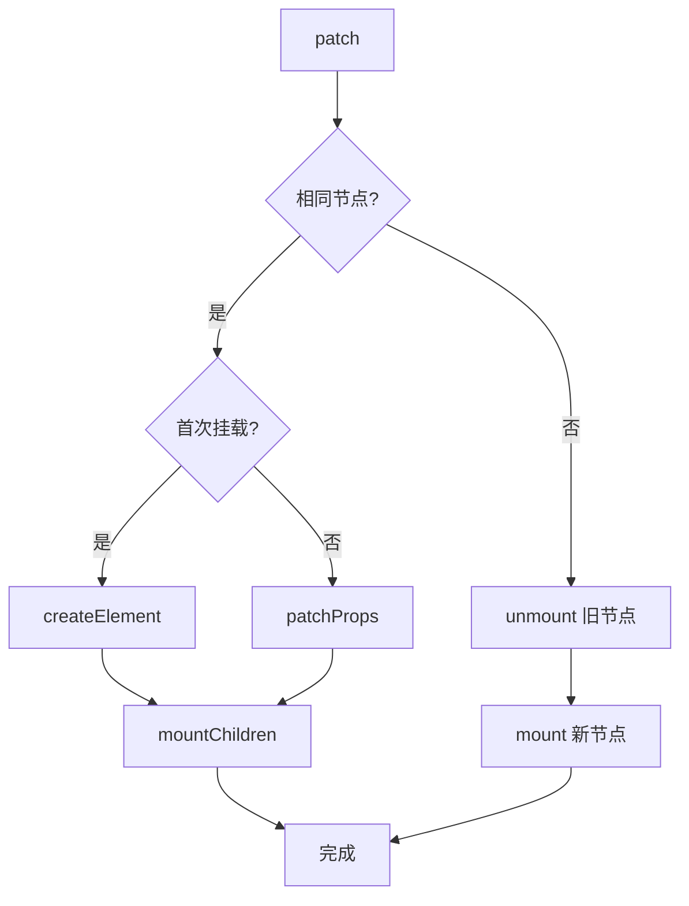

# 渲染器详解

渲染器（Renderer）是 Vue 运行时核心组件，负责将虚拟 DOM（VNode）转换为真实 DOM。mini-vue 的渲染器采用平台无关的设计，通过适配器模式支持不同平台。

## 渲染器架构

```typescript
// packages/runtime-core/src/renderer.ts

// 创建渲染器
export function createRenderer(options) {
  const {
    createElement: hostCreateElement,
    patchProp: hostPatchProp,
    insert: hostInsert,
    remove: hostRemove,
    setElementText: hostSetElementText,
    // ... 更多平台特定方法
  } = options

  function render(vnode, container) {
    if (vnode == null) {
      // 卸载
      if (container._vnode) {
        unmount(container._vnode)
      }
    } else {
      // 挂载或更新
      patch(container._vnode || null, vnode, container)
    }
    container._vnode = vnode
  }

  return { render }
}
```

## 核心 API

### 渲染器选项

```typescript
interface RendererOptions {
  // 创建元素
  createElement(type: string): any

  // 处理属性
  patchProp(
    el: any,
    key: string,
    prevValue: any,
    nextValue: any
  ): void

  // 插入节点
  insert(el: any, parent: any, anchor?: any): void

  // 移除节点
  remove(el: any): void

  // 设置元素文本
  setElementText(el: any, text: string): void

  // 创建文本节点
  createText(text: string): any

  // 设置文本节点
  setText(node: any, text: string): void

  // 创建注释节点
  createComment(text: string): any
}
```

## patch 流程

### 主 patch 函数

```typescript
function patch(n1, n2, container, anchor) {
  // 节点类型不同，直接替换
  if (n1 && !isSameVNodeType(n1, n2)) {
    anchor = getNextSibling(n1)
    unmount(n1)
    n1 = null
  }

  const { type, shapeFlag } = n2

  switch (type) {
    case Text:
      processText(n1, n2, container, anchor)
      break
    case Comment:
      processCommentNode(n1, n2, container, anchor)
      break
    case Fragment:
      processFragment(n1, n2, container, anchor)
      break
    default:
      if (shapeFlag & ShapeFlags.ELEMENT) {
        processElement(n1, n2, container, anchor)
      } else if (shapeFlag & ShapeFlags.COMPONENT) {
        processComponent(n1, n2, container, anchor)
      }
  }
}
```

### 元素处理流程



### processElement

```typescript
function processElement(n1, n2, container, anchor) {
  if (!n1) {
    // 挂载新元素
    mountElement(n2, container, anchor)
  } else {
    // 更新已有元素
    patchElement(n1, n2)
  }
}

function mountElement(vnode, container, anchor) {
  const { type, props, children } = vnode

  // 1. 创建真实 DOM 元素
  const el = vnode.el = hostCreateElement(type)

  // 2. 设置属性
  if (props) {
    for (const key in props) {
      hostPatchProp(el, key, null, props[key])
    }
  }

  // 3. 处理子节点
  if (shapeFlag & ShapeFlags.TEXT_CHILDREN) {
    hostSetElementText(el, children)
  } else if (shapeFlag & ShapeFlags.ARRAY_CHILDREN) {
    mountChildren(vnode, el)
  }

  // 4. 插入到 DOM
  hostInsert(el, container, anchor)
}

function patchElement(n1, n2) {
  const el = n2.el = n1.el

  // 1. 更新属性
  patchProps(n1.props, n2.props, el)

  // 2. 更新子节点
  patchChildren(n1, n2, el)
}
```

## Diff 算法

Vue 3 使用优化的双端 Diff 算法，将复杂度从 O(n³) 优化到 O(n)。

### patchKeyedChildren

```typescript
function patchKeyedChildren(c1, c2, container, anchor) {
  let i = 0
  const l2 = c2.length
  let e1 = l1 - 1
  let e2 = l2 - 1

  // 1. 自前向后对比
  while (i <= e1 && i <= e2) {
    const n1 = c1[i]
    const n2 = c2[i]
    if (isSameVNodeType(n1, n2)) {
      patch(n1, n2, container, anchor)
    } else {
      break
    }
    i++
  }

  // 2. 自后向前对比
  while (i <= e1 && i <= e2) {
    const n1 = c1[e1]
    const n2 = c2[e2]
    if (isSameVNodeType(n1, n2)) {
      patch(n1, n2, container, anchor)
    } else {
      break
    }
    e1--
    e2--
  }

  // 3. 处理新增/删除
  if (i > e1) {
    // 新节点多于旧节点 - 新增
    while (i <= e2) {
      patch(null, c2[i], container, anchor)
      i++
    }
  } else if (i > e2) {
    // 旧节点多于新节点 - 删除
    while (i <= e1) {
      unmount(c1[i])
      i++
    }
  } else {
    // 4. 处理乱序
    patchUnkeyedChildren(c1, c2, container, anchor)
  }
}
```

### 乱序处理 - 最长递增子序列

```typescript
function patchUnkeyedChildren(c1, c2, container, anchor) {
  // 建立新节点 key 到索引的映射
  const keyToNewIndexMap = new Map()
  for (let i = 0; i < c2.length; i++) {
    const child = c2[i]
    if (child.key != null) {
      keyToNewIndexMap.set(child.key, i)
    }
  }

  // 遍历旧节点
  for (let i = 0; i < c1.length; i++) {
    const oldChild = c1[i]
    const newIndex = keyToNewIndexMap.get(oldChild.key)

    if (newIndex === undefined) {
      // 旧节点不存在于新数组 - 删除
      unmount(oldChild)
    } else {
      // 存在 - patch 并移动
      patch(oldChild, c2[newIndex], container, anchor)
    }
  }

  // 处理新增节点
  for (let i = 0; i < c2.length; i++) {
    // ...处理新增
  }
}
```

## 组件处理

### processComponent

```typescript
function processComponent(n1, n2, container, anchor) {
  if (!n1) {
    // 挂载组件
    mountComponent(n2, container, anchor)
  } else {
    // 更新组件
    patchComponent(n1, n2, container, anchor)
  }
}

function mountComponent(vnode, container, anchor) {
  // 1. 创建组件实例
  const instance = vnode.component = createComponentInstance(vnode)

  // 2. 初始化组件
  setupComponent(instance)

  // 3. 设置渲染副作用
  setupRenderEffect(instance, vnode, container, anchor)
}
```

## DOM 操作

### 节点操作 API

```typescript
// packages/runtime-dom/src/nodeOps.ts

export const nodeOps = {
  // 创建元素
  createElement(tag) {
    return document.createElement(tag)
  },

  // 创建文本节点
  createText(text) {
    return document.createTextNode(text)
  },

  // 插入节点
  insert(child, parent, anchor = null) {
    parent.insertBefore(child, anchor)
  },

  // 移除节点
  remove(child) {
    const parent = child.parentNode
    if (parent) {
      parent.removeChild(child)
    }
  },

  // 设置元素文本
  setElementText(el, text) {
    el.textContent = text
  },

  // 设置文本节点
  setText(node, text) {
    node.nodeValue = text
  }
}
```

### 属性处理

```typescript
// packages/runtime-dom/src/patchProp.ts

export function patchProp(el, key, prevValue, nextValue) {
  if (key === 'class') {
    patchClass(el, nextValue)
  } else if (isOn(key)) {
    patchEvent(el, key, prevValue, nextValue)
  } else if (key === 'style') {
    patchStyle(el, prevValue, nextValue)
  } else {
    patchAttr(el, key, nextValue)
  }
}
```

## 渲染器创建

### createApp

```typescript
// packages/runtime-core/src/apiCreateApp.ts

export function createApp(rootComponent, rootProps) {
  const app = {
    _component: rootComponent,
    _props: rootProps,
    _container: null,

    mount(rootContainer) {
      if (!isElement(rootContainer)) {
        rootContainer = document.querySelector(rootContainer)
      }

      // 创建 VNode
      const vnode = createVNode(rootComponent, rootProps)

      // 渲染
      render(vnode, rootContainer)

      app._container = rootContainer
      return vnode.component.proxy
    }
  }

  return app
}
```

## 总结

渲染器的核心设计：

1. **平台无关**：渲染逻辑与平台操作分离
2. **patch 机制**：通过对比新旧 VNode 最小化 DOM 操作
3. **Diff 算法**：O(n) 复杂度的优化算法
4. **组件支持**：完整的组件生命周期管理
5. **批量更新**：与调度器配合实现高效更新
