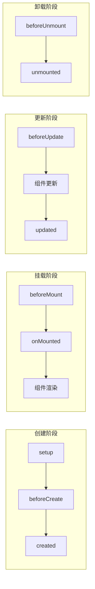

# 生命周期钩子详解

Vue 组件生命周期钩子让开发者能在组件的不同阶段执行自定义逻辑。mini-vue 实现了 Vue 3 的核心生命周期钩子。

## 生命周期流程



## 生命周期钩子分类

### 1. 创建阶段钩子

| 钩子 | 说明 |
|------|------|
| `beforeCreate` | 组件实例创建前调用 |
| `created` | 组件实例创建后调用 |

### 2. 挂载阶段钩子

| 钩子 | 说明 |
|------|------|
| `beforeMount` | 组件挂载前调用 |
| `onMounted` | 组件挂载后调用 |

### 3. 更新阶段钩子

| 钩子 | 说明 |
|------|------|
| `beforeUpdate` | 组件更新前调用 |
| `updated` | 组件更新后调用 |

### 4. 卸载阶段钩子

| 钩子 | 说明 |
|------|------|
| `beforeUnmount` | 组件卸载前调用 |
| `onUnmounted` | 组件卸载后调用 |

## 实现原理

### 生命周期钩子注册

```typescript
// packages/runtime-core/src/apiLifecycle.ts

// 当前正在处理的组件实例
let currentInstance = null

export function setCurrentInstance(instance) {
  currentInstance = instance
}

export function getCurrentInstance() {
  return currentInstance
}

// 生命周期钩子类型
const LIFECYCLE_HOOKS = [
  'bm',    // beforeMount
  'm',     // mounted
  'bu',    // beforeUpdate
  'u',     // updated
  'bum',   // beforeUnmount
  'um',    // unmounted
]

// 创建生命周期钩子函数
export function createHook(type) {
  return (hook, target = currentInstance) => {
    if (target) {
      // 将钩子函数添加到实例上
      const hooks = target[type] || (target[type] = [])
      hooks.push(hook)
    }
  }
}

// 创建各个生命周期钩子
export const onBeforeMount = createHook('bm')
export const onMounted = createHook('m')
export const onBeforeUpdate = createHook('bu')
export const onUpdated = createHook('u')
export const onBeforeUnmount = createHook('bum')
export const onUnmounted = createHook('um')
```

### 生命周期钩子调用

在组件挂载和更新过程中调用相应的钩子：

```typescript
// 挂载阶段的钩子调用
function mountComponent(initialVNode, container, anchor) {
  const instance = initialVNode.component = createComponentInstance(initialVNode)
  setupComponent(instance)

  setupRenderEffect(instance, initialVNode, container, anchor)
}

function setupRenderEffect(instance, initialVNode, container, anchor) {
  const componentUpdateFn = () => {
    if (!instance.isMounted) {
      // === 挂载阶段 ===
      const { bm, m } = instance

      // 调用 beforeMount 钩子
      if (bm) {
        bm.forEach(hook => hook())
      }

      // 渲染组件
      const subTree = (instance.subTree = renderComponentRoot(instance))
      patch(null, subTree, container, anchor)

      // 调用 mounted 钩子
      if (m) {
        m.forEach(hook => hook())
      }

      instance.isMounted = true
    } else {
      // === 更新阶段 ===
      const { bu, u } = instance

      // 调用 beforeUpdate 钩子
      if (bu) {
        bu.forEach(hook => hook())
      }

      // 更新组件
      const nextTree = renderComponentRoot(instance)
      const prevTree = instance.subTree
      instance.subTree = nextTree
      patch(prevTree, nextTree, container, anchor)

      // 调用 updated 钩子
      if (u) {
        u.forEach(hook => hook())
      }
    }
  }

  // ... 创建响应式副作用
}
```

### 卸载阶段的钩子调用

```typescript
// 组件卸载
function unmount(vnode) {
  const { type, props, children, component } = vnode

  if (type === ShapeFlags.COMPONENT) {
    // 调用 beforeUnmount 钩子
    const { bum } = component
    if (bum) {
      bum.forEach(hook => hook())
    }

    // 卸载子组件
    unmount(component.subTree)

    // 调用 unmounted 钩子
    const { um } = component
    if (um) {
      um.forEach(hook => hook())
    }
  } else {
    // 普通元素卸载
    remove(vnode.el)
  }
}
```

## 使用示例

### 组件中使用生命周期钩子

```javascript
import { ref, onMounted, onUpdated, onBeforeUnmount } from 'mini-vue'

export default {
  setup() {
    const count = ref(0)

    // 组件挂载后
    onMounted(() => {
      console.log('组件已挂载')
    })

    // 组件更新后
    onUpdated(() => {
      console.log('组件已更新')
    })

    // 组件卸载前
    onBeforeUnmount(() => {
      console.log('组件即将卸载')
    })

    // 组件卸载后
    onUnmounted(() => {
      console.log('组件已卸载')
    })

    return { count }
  }
}
```

### 生命周期钩子执行顺序

```
父组件挂载: parent beforeCreate → parent created → parent beforeMount
  → 子组件 beforeCreate → 子组件 created → 子组件 beforeMount
  → 子组件 mounted → parent mounted

父组件更新: parent beforeUpdate
  → 子组件 beforeUpdate → 子组件 updated
  → parent updated

父组件卸载: parent beforeUnmount
  → 子组件 beforeUnmount → 子组件 unmounted
  → parent unmounted
```

## 调度器集成

生命周期钩子通过调度器异步执行，确保 DOM 更新完成后再调用：

```typescript
// 调度器确保钩子在正确的时机执行
function queuePreFlushCb(cb) {
  queue.push(cb)
  queueFlush()
}

function flushJobs() {
  // 按顺序执行队列中的回调
  for (let i = 0; i < queue.length; i++) {
    queue[i]()
  }
  queue.length = 0
}
```

## 总结

Vue 3 生命周期钩子的实现要点：

1. **注册机制**：通过 `createHook` 工厂函数创建钩子注册函数
2. **存储方式**：钩子函数存储在组件实例的对应属性中
3. **调用时机**：在组件挂载、更新、卸载的适当位置调用
4. **异步执行**：通过调度器确保在 DOM 更新后执行
5. **执行顺序**：父组件钩子先于子组件，但 mounted/updated 相反
