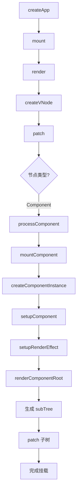
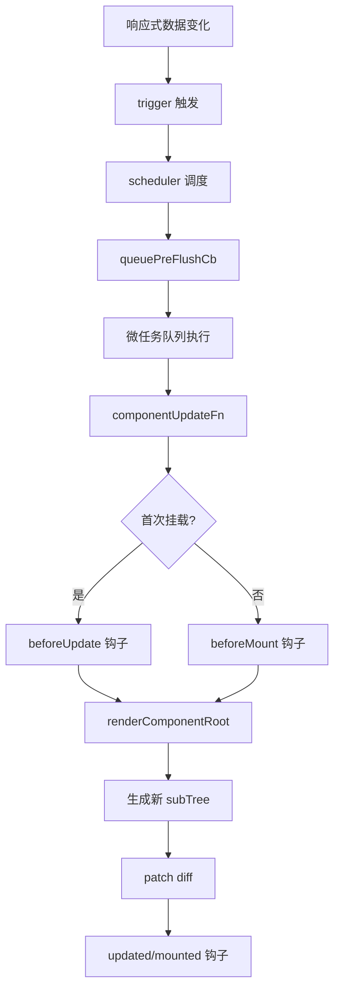

# 组件系统详解

组件系统是 Vue 最核心的特性之一，它将 UI 拆分为可复用的组件，每个组件拥有自己的模板、逻辑和样式。mini-vue 实现了 Vue 3 的组件系统核心功能。

## 组件创建流程

### 1. createComponentInstance

创建组件实例是组件生命周期的起点。

```typescript
// packages/runtime-core/src/component.ts
export function createComponentInstance(vnode) {
  const instance = {
    vnode,                    // 组件 VNode
    type: vnode.type,         // 组件选项对象
    props: null,              // 组件 props
    setupState: EMPTY_OBJ,    // setup() 返回的状态
    ctx: EMPTY_OBJ,           // 组件上下文
    refs: EMPTY_OBJ,          // 模板 ref
    data: EMPTY_OBJ,          // data() 返回的数据
    render: null,             // 渲染函数
    subTree: null,            // 组件渲染的子树
    isMounted: false,         // 是否已挂载
    update: null,             // 更新函数
    effect: null,             // 响应式副作用
    // 生命周期钩子
    bm: null,                 // beforeMount
    m: null,                  // mounted
    bu: null,                 // beforeUpdate
    u: null,                  // updated
   bum: null,                // beforeUnmount
    um: null,                 // unmounted
  }
  return instance
}
```

### 2. setupComponent

标准化组件实例数据，包括处理 props、slots、setup 等。

```typescript
function setupComponent(instance) {
  const { props, children } = instance.vnode

  // 初始化 props
  instance.props = props

  // 初始化 setup 状态
  const setup = instance.type.setup
  if (setup) {
    const setupResult = setup(instance.props, {
      emit: instance.emit
    })
    handleSetupResult(instance, setupResult)
  }
}

function handleSetupResult(instance, setupResult) {
  if (typeof setupResult === 'object') {
    instance.setupState = proxyRefs(setupResult)
  }
  // 处理 render 函数
  if (instance.type.render) {
    instance.render = instance.type.render
  }
}
```

### 3. setupRenderEffect

设置组件渲染副作用，将组件的响应式数据与渲染逻辑关联。

```typescript
function setupRenderEffect(instance, initialVNode, container, anchor) {
  const componentUpdateFn = () => {
    if (!instance.isMounted) {
      // === 挂载阶段 ===
      const { bm, m } = instance

      // 执行 beforeMount 钩子
      if (bm) bm()

      // 渲染组件得到子树
      const subTree = (instance.subTree = renderComponentRoot(instance))

      // patch 渲染到 DOM
      patch(null, subTree, container, anchor)

      // 执行 mounted 钩子
      if (m) m()

      // 保存真实 DOM 引用
      initialVNode.el = subTree.el
      instance.isMounted = true
    } else {
      // === 更新阶段 ===
      const nextTree = renderComponentRoot(instance)
      const prevTree = instance.subTree
      instance.subTree = nextTree

      // diff 算法更新
      patch(prevTree, nextTree, container, anchor)
    }
  }

  // 创建响应式副作用
  const effect = (instance.effect = new ReactiveEffect(
    componentUpdateFn,
    () => queuePreFlushCb(update)  // 调度器
  ))

  const update = (instance.update = () => effect.run())
  update()
}
```

## 组件挂载流程



## 组件更新流程

当组件的响应式数据发生变化时，触发更新：



## 组件类型

mini-vue 支持多种组件类型：

```typescript
// ShapeFlags 定义
export const enum ShapeFlags {
  ELEMENT = 1,                     // 普通 HTML 元素
  FUNCTIONAL_COMPONENT = 1 << 1,   // 函数式组件
  STATEFUL_COMPONENT = 1 << 2,    // 有状态组件
  TEXT_CHILDREN = 1 << 3,         // 文本子节点
  ARRAY_CHILDREN = 1 << 4,        // 数组子节点
  SLOTS_CHILDREN = 1 << 5,        // 插槽子节点
}
```

### 有状态组件

普通的 Vue 组件，拥有自己的状态和生命周期。

```javascript
const MyComponent = {
  props: {
    title: String
  },
  data() {
    return {
      count: 0
    }
  },
  setup(props) {
    // setup 逻辑
    return {
      // 返回状态
    }
  },
  render() {
    return h('div', this.title)
  }
}
```

### 函数式组件

无状态的函数组件，只接受 props 并返回 VNode。

```typescript
// ShapeFlags.FUNCTIONAL_COMPONENT
const FunctionalComponent = (props, context) => {
  return h('div', props.title)
}
```

## 组件通信

### Props 传递

```typescript
// 父组件
const Parent = {
  render() {
    return h(Child, { msg: 'hello' })
  }
}

// 子组件
const Child = {
  props: ['msg'],
  render() {
    return h('div', this.msg)
  }
}
```

### 事件触发

```typescript
// 子组件触发事件
function emit(event, ...args) {
  const handler = instance.vnode.props[`on${capitalize(event)}`]
  if (handler) {
    handler(...args)
  }
}

// 使用
emit('update', newValue)
```

## 组件实例属性

组件实例上暴露了丰富的属性和方法：

```typescript
instance = {
  // 组件配置
  type: Component,
  vnode: VNode,

  // 响应式状态
  props: object,
  data: object,
  refs: object,
  setupState: object,

  // 渲染
  render: Function,
  subTree: VNode,

  // 生命周期状态
  isMounted: boolean,

  // 生命周期钩子
  bm: Function,  // beforeMount
  m: Function,   // mounted
  bu: Function,  // beforeUpdate
  u: Function,   // updated
  bum: Function, // beforeUnmount
  um: Function,  // unmounted
}
```

## 渲染组件根节点

`renderComponentRoot` 函数负责执行组件的渲染函数：

```typescript
function renderComponentRoot(instance) {
  const { render, data, setupState, props } = instance

  // 创建渲染上下文
  const ctx = Object.assign({}, data, setupState, props)

  // 执行渲染函数
  return render.call(ctx, ctx)
}
```

## 总结

组件系统是 Vue 框架的核心，它通过以下机制实现：

1. **实例管理**：每个组件都有对应的实例对象
2. **响应式绑定**：组件状态与响应式系统深度集成
3. **生命周期**：提供完整的挂载、更新、卸载钩子
4. **渲染函数**：将组件状态转换为 VNode 树
5. **调度更新**：通过调度器协调组件更新时机

理解组件系统的工作原理，有助于更好地使用 Vue 并解决实际问题。
