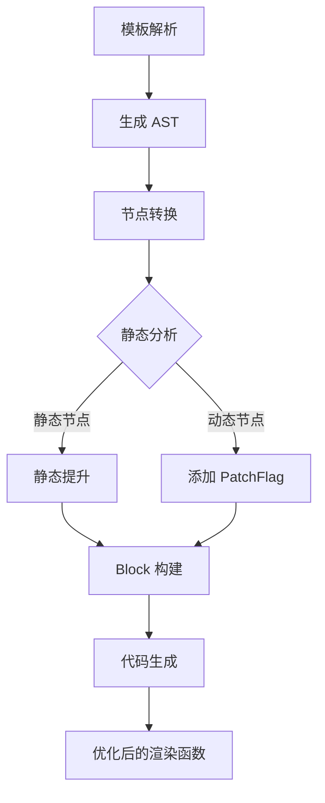

# 编译优化策略详解

Vue 3 编译器采用了多种优化策略，以提高运行时性能和减少生成的代码体积。

## 优化策略概览

| 策略 | 说明 | 效果 |
|------|------|------|
| 静态提升 | 将静态节点提升到渲染函数外 | 减少重复创建 |
| 预字符串化 | 静态节点序列化为字符串 | 减少 VNode 数量 |
| 缓存事件处理函数 | 缓存 @click 等处理函数 | 避免重复创建函数 |
| Block 优化 | 动态节点标记 | 快速定位动态节点 |
| PatchFlag | 节点更新标记 | 只更新变化的部分 |

## 1. 静态提升（Static Hoisting）

### 不使用优化

```html
<!-- 模板 -->
<div>
  <p>static text</p>
  <p>{{ dynamic }}</p>
</div>
```

```javascript
// 每次渲染都会创建 static 节点
export function render(_ctx, _cache) {
  return _openBlock(), _createElementBlock("div", null, [
    _createElementVNode("p", null, "static text"),
    _createElementVNode("p", null, _toDisplayString(_ctx.dynamic), 1)
  ])
}
```

### 使用静态提升

```javascript
// 静态节点在渲染函数外创建
const _hoisted_1 = /*#__PURE__*/_createElementVNode("p", null, "static text", -1)

export function render(_ctx, _cache) {
  return _openBlock(), _createElementBlock("div", null, [
    _hoisted_1,
    _createElementVNode("p", null, _toDisplayString(_ctx.dynamic), 1)
  ])
}
```

### 实现原理

```typescript
// packages/compiler-core/src/hoistStatic.ts

export function hoistStatic(root, context) {
  walk(root, {
    enter(node) {
      if (!isDynamic(node, context)) {
        // 静态节点，提升到作用域外
        const hoisted = node
        context.hoists.push(hoisted)
        node.codegenNode = context.helper(CREATE_ELEMENT_VNODE)
        node.codegenNode.arguments[3] = -1 // PatchFlag = -1 表示静态
      }
    }
  })
}
```

## 2. 预字符串化（Pre-stringification）

### 示例

```html
<!-- 模板 -->
<div>
  <span>1</span>
  <span>2</span>
  <span>3</span>
  <!-- 更多静态 span -->
</div>
```

### 优化后

```javascript
// 连续的静态节点序列化为字符串
const _hoisted_2 = `<span>1</span><span>2</span><span>3</span>...`

export function render(_ctx, _cache) {
  return _createElementBlock("div", null, _hoisted_2)
}
```

## 3. 事件处理函数缓存

### 不使用优化

```html
<!-- 模板 -->
<button @click="count++">Count: {{ count }}</button>
```

```javascript
// 每次渲染都创建新函数
export function render(_ctx, _cache) {
  return _createElementVNode("button", {
    onClick: $event => (_ctx.count++)
  }, "Count: " + _toDisplayString(_ctx.count), 1)
}
```

### 使用缓存

```javascript
// 缓存事件处理函数
export function render(_ctx, _cache) {
  return (_openBlock(), _createElementBlock("button", {
    onClick: _cache[0] || (_cache[0] = ($event) => (_ctx.count++))
  }, "Count: " + _toDisplayString(_ctx.count), 1))
}
```

### 实现原理

```typescript
// 编译器识别内联事件处理函数
if (isStatic && isHandler) {
  // 缓存事件处理函数
  node.codegenNode = {
    type: NodeTypes.JS_CACHE_EXPRESSION,
    index: cacheIndex++
  }
}
```

## 4. Block 优化

### 传统 VNode 树

```javascript
// 扁平化的 VNode 树
[
  div,          // 动态
  [             // children
    p,          // 静态
    span,       // 动态
    text        // 动态
  ]
]
```

### Block 结构

```javascript
// Block VNode - 跟踪所有动态子节点
const block = {
  type: 'div',
  dynamicChildren: [
    { type: 'span', dynamic: true },
    { type: 'text', dynamic: true }
  ]
}
```

### PatchFlag

```typescript
// PatchFlag 常量
export const enum PatchFlags {
  TEXT = 1,        // 只更新文本内容
  CLASS = 2,       // 只更新 class
  STYLE = 4,       // 只更新 style
  PROPS = 8,       // 只更新属性
  FULL_PROPS = 16, // 更新所有属性
  HYDRATE_EVENTS = 32, // 事件
}
```

### 使用 PatchFlag

```html
<!-- 模板 -->
<p class="static" :class="dynamicClass">{{ text }}</p>
```

```javascript
// 只标记需要更新的部分
_createElementVNode(
  "p",
  { class: "static", [PatchFlags.CLASS]: _ctx.dynamicClass },
  _toDisplayString(_ctx.text),
  PatchFlags.TEXT
)
```

## 5. v-if 优化

### 编译结果

```html
<!-- 模板 -->
<h1 v-if="show">Title</h1>
```

```javascript
// 编译为三元表达式
export function render(_ctx, _cache) {
  return _ctx.show
    ? _createElementVNode("h1", null, "Title")
    : _createCommentVNode("v-if")
}
```

### v-else-if 链

```html
<!-- 模板 -->
<div v-if="a">a</div>
<div v-else-if="b">b</div>
<div v-else>c</div>
```

```javascript
// 编译为三元链
export function render(_ctx, _cache) {
  return _ctx.a
    ? _createElementVNode("div", null, "a")
    : _ctx.b
    ? _createElementVNode("div", null, "b")
    : _createElementVNode("div", null, "c")
}
```

## 6. v-for 优化

### 编译结果

```html
<!-- 模板 -->
<li v-for="item in items" :key="item.id">{{ item.name }}</li>
```

```javascript
// 使用 renderList 辅助函数
export function render(_ctx, _cache) {
  return _renderList(_ctx.items, (item) => {
    return _createElementVNode("li", { key: item.id },
      _toDisplayString(item.name), 1
    )
  })
}
```

## 7. 编译优化流程



## 8. 运行时优化配合

### createElementBlock

```typescript
// 优化的创建元素函数
function createElementBlock(type, props, children, patchFlag) {
  // 记录动态子节点
  const block = createBaseVNode(type, props, children, patchFlag)
  block.dynamicChildren = collectDynamicChildren(children)
  return block
}
```

### openBlock

```typescript
// 打开 Block 跟踪
function openBlock() {
  // 记录当前的动态子节点数组
  currentBlock = []
}
```

## 性能对比

| 操作 | 优化前 | 优化后 |
|------|--------|--------|
| 静态节点 | 每次渲染创建 | 只创建一次 |
| 事件处理 | 每次创建新函数 | 缓存复用 |
| diff | 遍历所有节点 | 只遍历动态节点 |
| 内存 | 多次创建对象 | 复用提升的对象 |

## 总结

Vue 3 编译优化的核心思想：

1. **减少创建**：静态内容只创建一次
2. **精准更新**：只更新变化的 DOM 部分
3. **函数缓存**：避免重复创建闭包函数
4. **Block 追踪**：快速定位需要更新的节点
5. **配合运行时**：编译器与渲染器紧密配合
