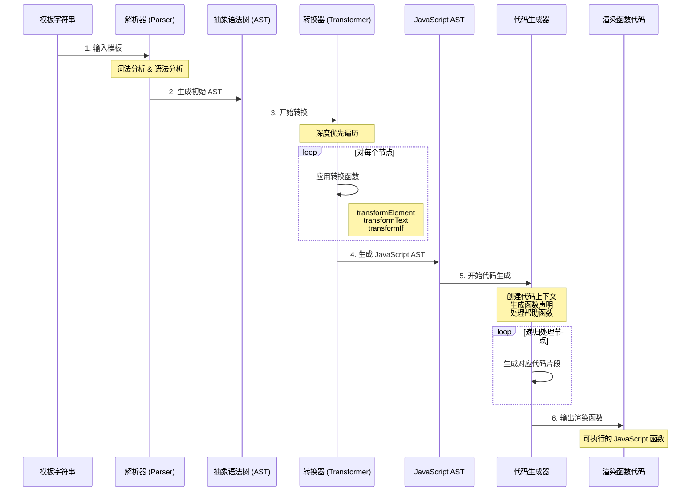

# 编译器（Compiler）

Vue 编译器是将模板语法转换为可执行渲染函数的核心组件。本项目的编译器分为两个主要包：

- **`compiler-core`**：平台无关的核心编译逻辑
- **`compiler-dom`**：DOM 平台特定的编译扩展

## 🏗️ 编译器架构

编译器采用三阶段编译流程：**解析（Parse）** → **转换（Transform）** → **代码生成（Codegen）**

### 整体流程

```
模板字符串 → AST → JavaScript AST → 渲染函数代码
```




## 🔍 详细原理与步骤

### 第一阶段：Parse（解析）

**目标**：将模板字符串解析为抽象语法树（AST）

#### 核心文件
- `parse.ts` - 主要解析逻辑

#### 工作原理

1. **词法分析（Tokenization）**
   - 将模板字符串分解为一系列 token
   - 识别标签、文本、插值表达式、指令等

2. **语法分析（Parsing）**
   - 基于 token 构建 AST 节点
   - 处理嵌套结构和节点关系

#### 支持的节点类型

```typescript
enum NodeTypes {
  ROOT,           // 根节点
  ELEMENT,        // 元素节点 <div>
  TEXT,           // 文本节点
  INTERPOLATION,  // 插值表达式 {{ }}
  DIRECTIVE,      // 指令 v-if, v-for
  ATTRIBUTE,      // 属性
  // ... 更多类型
}
```

#### 解析示例

**输入模板：**
```html
<div>{{ msg }}</div>
```

**生成的 AST：**
```javascript
{
  type: NodeTypes.ROOT,
  children: [{
    type: NodeTypes.ELEMENT,
    tag: 'div',
    children: [{
      type: NodeTypes.INTERPOLATION,
      content: {
        type: NodeTypes.SIMPLE_EXPRESSION,
        content: 'msg'
      }
    }]
  }]
}
```

### 第二阶段：Transform（转换）

**目标**：对 AST 进行优化和转换，生成 JavaScript AST

#### 核心文件
- `transform.ts` - 转换框架
- `transforms/transformElement.ts` - 元素转换
- `transforms/transformText.ts` - 文本转换  
- `transforms/vIf.ts` - v-if 指令转换

#### 转换特点

1. **深度优先遍历**：确保子节点先于父节点处理
2. **双阶段处理**：进入阶段（收集）+ 退出阶段（执行）
3. **插件化设计**：每种节点类型有对应的转换函数

#### 主要转换类型

**1. 元素转换（transformElement）**
```javascript
// 将元素节点转换为 createElementVNode 调用
<div></div> 
↓
createElementVNode("div", [], [])
```

**2. 文本转换（transformText）**
```javascript
// 合并相邻的文本和插值表达式
hello {{ msg }}
↓
"hello " + toDisplayString(msg)
```

**3. 条件转换（transformIf）**
```javascript
// 将 v-if 转换为条件表达式
<h1 v-if="show">Title</h1>
↓
show ? createElementVNode("h1", null, "Title") : createCommentVNode("v-if")
```

#### 转换上下文

```typescript
interface TransformContext {
  root: any                    // AST 根节点
  parent: ParentNode | null    // 父节点
  currentNode: any             // 当前处理节点
  helpers: Map<symbol, number> // 帮助函数映射
  nodeTransforms: any[]        // 转换函数数组
}
```

### 第三阶段：Codegen（代码生成）

**目标**：将 JavaScript AST 转换为可执行的渲染函数代码

#### 核心文件
- `codegen.ts` - 代码生成逻辑

#### 生成过程

1. **创建代码上下文**：管理代码字符串、缩进、帮助函数等
2. **生成函数前导**：导入必要的帮助函数
3. **生成函数体**：递归处理 JavaScript AST 节点
4. **优化输出**：压缩和格式化最终代码

#### 生成示例

**JavaScript AST 输入：**
```javascript
{
  type: NodeTypes.VNODE_CALL,
  tag: '"div"',
  children: [{ type: NodeTypes.TEXT, content: "hello" }]
}
```

**生成的渲染函数：**
```javascript
const _Vue = Vue

return function render(_ctx, _cache) {
  with (_ctx) {
    const { createElementVNode: _createElementVNode } = _Vue
    
    return _createElementVNode("div", null, ["hello"])
  }
}
```

## 🔧 主要 API

### compiler-core

```typescript
// 基础编译函数
export function baseCompile(template: string, options = {})

// 各阶段函数
export function baseParse(template: string)           // 解析
export function transform(ast: any, options: any)    // 转换  
export function generate(ast: any)                   // 代码生成
```

### compiler-dom

```typescript
// DOM 平台编译函数
export function compile(template: string, options?: any)
```

## 📝 使用示例

### 基础编译

```javascript
import { compile } from 'mini-vue'

const template = '<div>{{ message }}</div>'
const { code } = compile(template)

console.log(code)
// 输出生成的渲染函数代码
```

### 带指令的模板

```javascript
const template = `
  <div>
    <h1 v-if="show">{{ title }}</h1>
    <p>{{ content }}</p>
  </div>
`

const { code } = compile(template)
// 生成包含条件渲染的函数代码
```

### 运行时使用

```javascript
const { compile, h, render } = Vue

// 编译模板
const renderFn = compile('<div>Hello {{ name }}</div>')

// 创建组件
const component = {
  data: () => ({ name: 'Vue' }),
  render: renderFn
}

// 渲染到页面
render(h(component), document.getElementById('app'))
```

## 🎯 设计特点

### 1. 模块化设计
- 核心逻辑与平台特定逻辑分离
- 转换函数插件化，易于扩展

### 2. 性能优化
- 静态提升：识别静态内容，避免重复创建
- 深度优先遍历：确保正确的处理顺序
- 帮助函数缓存：避免重复导入

### 3. 错误处理
- 位置信息跟踪：准确定位错误位置
- 渐进式解析：尽可能解析有效部分

### 4. 扩展性
- 自定义转换函数支持
- 平台特定编译器扩展

## 🔍 调试技巧

### 查看 AST
```javascript
import { baseParse } from 'mini-vue/compiler-core'

const ast = baseParse('<div>{{ msg }}</div>')
console.log(JSON.stringify(ast, null, 2))
```

### 查看转换结果
```javascript
import { baseCompile } from 'mini-vue/compiler-core'

const result = baseCompile('<div>{{ msg }}</div>')
console.log('Generated code:', result.code)
```

## 📚 相关示例

完整的编译器使用示例可以在以下目录找到：

- `packages/vue/examples/compiler/compiler.html` - 基础编译示例
- `packages/vue/examples/compiler/compiler-directive.html` - 指令编译示例
- `packages/vue/examples/compiler/compiler-children.html` - 子节点处理示例

## 🚀 扩展编译器

### 添加自定义转换

```javascript
function customTransform(node, context) {
  if (node.type === NodeTypes.ELEMENT && node.tag === 'custom') {
    // 自定义转换逻辑
    return function exitTransform() {
      // 退出时执行的逻辑
    }
  }
}

// 使用自定义转换
const options = {
  nodeTransforms: [customTransform]
}
```

### 平台特定扩展

```javascript
// 继承 compiler-core 创建平台特定编译器
import { baseCompile } from 'compiler-core'

export function platformCompile(template, options) {
  return baseCompile(template, {
    ...options,
    // 平台特定配置
  })
}
```

编译器是 Vue 框架的核心组件之一，理解其工作原理有助于更好地使用和扩展 Vue 的功能。 