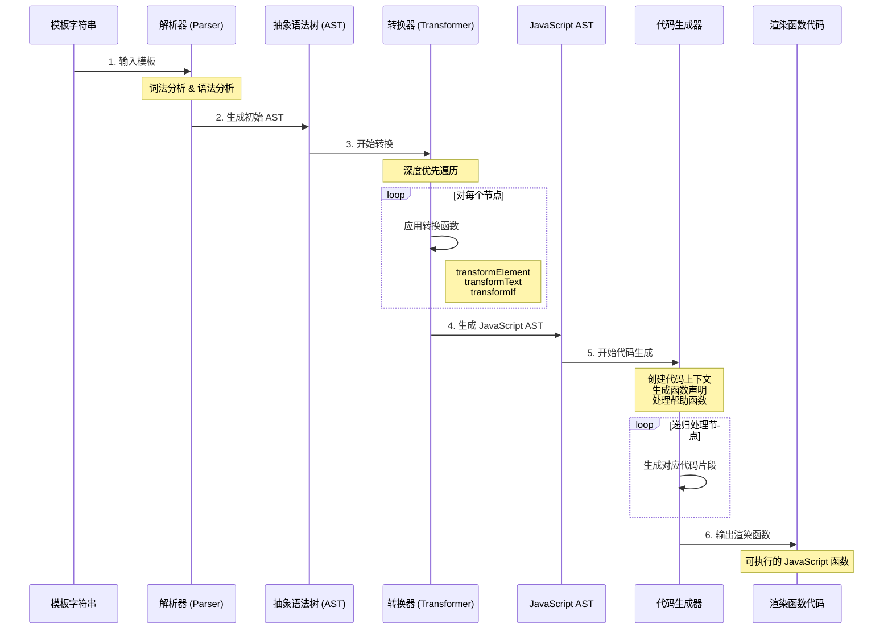

# Vue3 编译器原理详解

Vue3 的编译器是将模板语法转换为可执行 JavaScript 代码的核心组件。它采用三阶段编译流程：**解析（Parse）** → **转换（Transform）** → **代码生成（Codegen）**（Codegen），实现了高效的模板编译。

## 编译器架构

Vue3 编译器采用模块化设计，分为两个主要包：

- **compiler-core**: 平台无关的核心编译逻辑
- **compiler-dom**: DOM 平台特定的编译扩展

这种设计使得编译器可以轻松适配不同的平台，如 Web、小程序等。

### 整体流程

```
模板字符串 → AST → JavaScript AST → 渲染函数代码
```




## 三阶段编译流程

**解析（Parse）** → **转换（Transform）** → **代码生成（Codegen）**

### 1. 解析阶段（Parse）

解析阶段将模板字符串转换为抽象语法树（AST）。

#### 核心文件
- `parse.ts` - 主要解析逻辑

#### 工作原理

1. **词法分析（Tokenization）**
   - 将模板字符串分解为一系列 token
   - 识别标签、文本、插值表达式、指令等

2. **语法分析（Parsing）**
   - 基于 token 构建 AST 节点
   - 处理嵌套结构和节点关系

#### 工作原理
1. **词法分析**: 将模板字符串分解为一系列 token
2. **语法分析**: 基于 token 构建 AST 节点

#### 支持的节点类型
```typescript
enum NodeTypes {
  ROOT,           // 根节点
  ELEMENT,        // 元素节点 <div>
  TEXT,           // 文本节点
  COMMENT,        // 注释节点
  INTERPOLATION,  // 插值表达式 {{ }}
  DIRECTIVE,      // 指令 v-if, v-for
  ATTRIBUTE,      // 属性
  // ... 更多类型
}
```

#### 解析示例
输入模板：
```html
<div id="app">{{ msg }}</div>
```

生成的 AST：
```javascript
{
  type: NodeTypes.ROOT,
  children: [{
    type: NodeTypes.ELEMENT,
    tag: 'div',
    props: [{
      type: NodeTypes.ATTRIBUTE,
      name: 'id',
      value: {
        type: NodeTypes.TEXT,
        content: 'app'
      }
    }],
    children: [{
      type: NodeTypes.INTERPOLATION,
      content: {
        type: NodeTypes.SIMPLE_EXPRESSION,
        content: 'msg'
      }
    }]
  }]
}
```

### 2. 转换阶段（Transform）

转换阶段对 AST 进行优化和转换，生成 JavaScript AST。

#### 核心文件
- `transform.ts` - 转换框架
- `transforms/transformElement.ts` - 元素转换
- `transforms/transformText.ts` - 文本转换  
- `transforms/vIf.ts` - v-if 指令转换

#### 核心特点
1. **深度优先遍历**: 确保子节点先于父节点处理
2. **双阶段处理**: 进入阶段（收集）+ 退出阶段（执行）
3. **插件化设计**: 每种节点类型有对应的转换函数

#### 主要转换类型

**元素转换（transformElement）**
```javascript
// 将元素节点转换为 createElementVNode 调用
<div></div> 
↓
createElementVNode("div", [], [])
```

**文本转换（transformText）**
```javascript
// 合并相邻的文本和插值表达式
hello {{ msg }}
↓
"hello " + toDisplayString(msg)
```

**条件转换（transformIf）**
```javascript
// 将 v-if 转换为条件表达式
<h1 v-if="show">Title</h1>
↓
show ? createElementVNode("h1", null, "Title") : createCommentVNode("v-if")
```

#### 转换上下文
```typescript
interface TransformContext {
  root: any                    // AST 根节点
  parent: ParentNode | null    // 父节点
  currentNode: any             // 当前处理节点
  helpers: Map<symbol, number> // 帮助函数映射
  nodeTransforms: any[]        // 转换函数数组
}
```

### 3. 代码生成阶段（Codegen）

**目标**：将 JavaScript AST 转换为可执行的渲染函数代码

#### 核心文件
- `codegen.ts` - 代码生成逻辑

#### 生成过程
1. **创建代码上下文**: 管理代码字符串、缩进、帮助函数等
2. **生成函数前导**: 导入必要的帮助函数
3. **生成函数体**: 递归处理 JavaScript AST 节点
4. **优化输出**: 压缩和格式化最终代码

#### 生成示例
JavaScript AST 输入：
```javascript
{
  type: NodeTypes.VNODE_CALL,
  tag: '"div"',
  children: [{ type: NodeTypes.TEXT, content: "hello" }]
}
```

生成的渲染函数：
```javascript
const _Vue = Vue

return function render(_ctx, _cache) {
  with (_ctx) {
    const { createElementVNode: _createElementVNode } = _Vue
    
    return _createElementVNode("div", null, ["hello"])
  }
}
```

## 🔧 主要 API

### compiler-core

```typescript
// 基础编译函数
export function baseCompile(template: string, options = {})

// 各阶段函数
export function baseParse(template: string)           // 解析
export function transform(ast: any, options: any)    // 转换  
export function generate(ast: any)                   // 代码生成
```

### compiler-dom

```typescript
// DOM 平台编译函数
export function compile(template: string, options?: any)
```

## 核心优化策略

### 1. 静态提升（Static Hoisting）
识别静态内容，避免在每次渲染时重复创建。

```javascript
// 模板
<div>
  <p>static text</p>
  <p>{{ dynamic }}</p>
</div>

// 编译后
const _hoisted_1 = /*#__PURE__*/createElementVNode("p", null, "static text", -1)

export function render(_ctx, _cache) {
  return (openBlock(), createElementBlock("div", null, [
    _hoisted_1,
    createElementVNode("p", null, toDisplayString(_ctx.dynamic), 1)
  ]))
}
```

### 2. 预字符串化（Pre-stringification）
将连续的静态节点预先转换为字符串，减少创建的 VNode 数量。

### 3. 缓存事件处理函数
对内联事件处理函数进行缓存，避免在每次渲染时创建新函数。

```javascript
// 模板
<button @click="count++">Count: {{ count }}</button>

// 编译后
export function render(_ctx, _cache) {
  return (openBlock(), createElementBlock("button", {
    onClick: _cache[0] || (_cache[0] = $event => (_ctx.count++))
  }, "Count: " + toDisplayString(_ctx.count), 1))
}
```

## 指令编译

Vue3 编译器对各种指令进行了特殊处理：

### v-if / v-else-if / v-else
转换为条件表达式：
```javascript
{
  type: NodeTypes.IF,
  branches: [
    { condition: 'show', children: [/* vnode */] },
    { condition: 'other', children: [/* vnode */] },
    { condition: undefined, children: [/* vnode */] }
  ]
}
```

### v-for
转换为渲染函数调用：
```javascript
// 模板
<li v-for="item in items">{{ item }}</li>

// 编译后
renderList(_ctx.items, (item) => {
  return createElementVNode("li", null, toDisplayString(item), 1)
})
```

### v-bind
处理动态属性绑定：
```javascript
// 模板
<div :[key]="value" :class="cls"></div>

// 编译后
createElementVNode("div", {
  [key]: value,
  class: cls
})
```

## 错误处理与调试

### 位置信息跟踪
编译器会跟踪每个节点在源码中的位置信息，便于定位错误。

### 渐进式解析
尽可能解析有效部分，即使遇到错误也能生成部分有效的代码。

### 调试技巧
```javascript
// 查看 AST
import { baseParse } from 'vue/compiler-core'
const ast = baseParse('<div>{{ msg }}</div>')
console.log(JSON.stringify(ast, null, 2))

// 查看编译结果
import { compile } from 'vue/compiler-core'
const result = compile('<div>{{ msg }}</div>')
console.log('Generated code:', result.code)
```

## 平台适配

Vue3 编译器通过平台特定的扩展来适配不同平台：

```javascript
// DOM 平台编译器
import { baseCompile } from 'compiler-core'
import { parserOptions } from 'compiler-dom'

export function compile(template, options) {
  return baseCompile(template, {
    ...options,
    ...parserOptions,
    // 平台特定配置
  })
}
```

## 总结

Vue3 编译器通过三阶段编译流程，将模板高效地转换为渲染函数。其模块化设计和丰富的优化策略使得编译后的代码具有优异的性能。理解编译器的工作原理有助于开发者编写更高效的模板，也能在遇到编译问题时快速定位和解决。