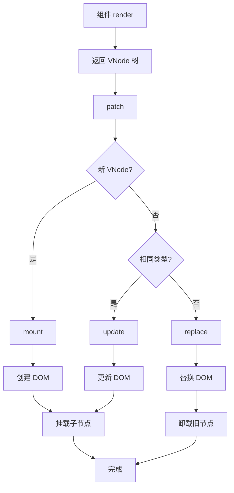

# 虚拟 DOM 详解

虚拟 DOM（Virtual DOM）是 Vue 渲染系统的核心概念，它是一个轻量级的 JavaScript 对象，用于描述真实的 DOM 结构。

## 为什么需要虚拟 DOM

1. **声明式 UI**：开发者只需描述 UI 状态，框架自动处理 DOM 更新
2. **性能优化**：通过 diff 算法最小化真实 DOM 操作
3. **跨平台**：同一套 VNode 可以渲染到不同平台（DOM、Native、WebGL）

## VNode 结构

```typescript
// packages/runtime-core/src/vnode.ts

interface VNode {
  __v_isVNode: true           // 标识这是 VNode
  type: any                   // 节点类型（标签名、组件、文本等）
  props: any                  // 节点属性
  children: any               // 子节点
  shapeFlag: number           // 节点类型标志（位运算）
  key: any                   // 节点唯一标识（用于 diff）
  el: any                    // 对应的真实 DOM 元素
  component: any             // 组件实例（组件类型时）
}
```

## VNode 类型

### 1. 元素节点

```javascript
// <div class="box">Hello</div>
{
  type: 'div',
  props: { class: 'box' },
  children: 'Hello',
  shapeFlag: ShapeFlags.ELEMENT | ShapeFlags.TEXT_CHILDREN
}
```

### 2. 文本节点

```javascript
// 纯文本 "Hello"
{
  type: Text,
  children: 'Hello',
  shapeFlag: ShapeFlags.TEXT_CHILDREN
}
```

### 3. 组件节点

```javascript
// <MyComponent :msg="hello" />
{
  type: MyComponent,
  props: { msg: 'hello' },
  children: null,
  shapeFlag: ShapeFlags.STATEFUL_COMPONENT
}
```

### 4. Fragment

```javascript
// <><div>A</div><div>B</div></>
{
  type: Fragment,
  children: [VNode, VNode],
  shapeFlag: ShapeFlags.ARRAY_CHILDREN
}
```

### 5. 注释节点

```javascript
{
  type: Comment,
  children: 'comment text',
  shapeFlag: ShapeFlags.COMMENT
}
```

## ShapeFlags - 位运算标记

使用位运算高效地组合和检查节点类型：

```typescript
// packages/shared/src/shapeFlags.ts

export const enum ShapeFlags {
  ELEMENT = 1,                     // 0001 - 普通元素
  FUNCTIONAL_COMPONENT = 1 << 1,  // 0010 - 函数组件
  STATEFUL_COMPONENT = 1 << 2,   // 0100 - 有状态组件
  TEXT_CHILDREN = 1 << 3,        // 1000 - 文本子节点
  ARRAY_CHILDREN = 1 << 4,       // 10000 - 数组子节点
  SLOTS_CHILDREN = 1 << 5,       // 100000 - 插槽子节点
  COMPONENT = STATEFUL_COMPONENT | FUNCTIONAL_COMPONENT, // 0110
}
```

### 位运算优势

```typescript
// 检查节点是否为元素
if (vnode.shapeFlag & ShapeFlags.ELEMENT) {
  // 是元素节点
}

// 检查是否有文本子节点
if (vnode.shapeFlag & ShapeFlags.TEXT_CHILDREN) {
  // 有文本子节点
}

// 组合检查
if (vnode.shapeFlag & (ShapeFlags.ELEMENT | ShapeFlags.TEXT_CHILDREN)) {
  // 是元素且有文本子节点
}
```

## VNode 创建

### createVNode

```typescript
export function createVNode(type, props, children, patchFlag, dynamicProps) {
  const shapeFlag = isString(type)
    ? ShapeFlags.ELEMENT
    : isObject(type)
    ? ShapeFlags.STATEFUL_COMPONENT
    : isFunction(type)
    ? ShapeFlags.FUNCTIONAL_COMPONENT
    : 0

  const vnode = {
    __v_isVNode: true,
    type,
    props,
    children: patchFlag ? children : normalizeChildren(vnode, children),
    shapeFlag,
    key: props?.key || null,
    el: null
  }

  return vnode
}
```

### h 函数 - 创建 VNode 的语法糖

```typescript
// packages/runtime-core/src/h.ts

// h('div', children)
// h('div', props, children)
// h('div', [children])
// h(Component, props, children)

export function h(type, propsOrChildren?, children?) {
  const l = arguments.length

  if (l === 2) {
    // h('div', { class: 'box' })
    // h('div', 'text')
    // h('div', [VNode, VNode])
    if (isObject(propsOrChildren) && !isArray(propsOrChildren)) {
      // 只有 props，没有 children
      return createVNode(type, propsOrChildren)
    } else {
      // children 是文本或数组
      return createVNode(type, null, propsOrChildren)
    }
  } else {
    // l >= 3
    return createVNode(type, propsOrChildren, children)
  }
}
```

## VNode 规范化

### normalizeChildren

```typescript
function normalizeChildren(vnode, children) {
  let type = 0
  if (children == null) {
    children = null
  } else if (isArray(children)) {
    type = ShapeFlags.ARRAY_CHILDREN
  } else if (isObject(children)) {
    // slot 对象
    type = ShapeFlags.SLOTS_CHILDREN
  } else {
    // 文本
    type = ShapeFlags.TEXT_CHILDREN
  }

  vnode.children = children
  vnode.shapeFlag |= type
  return vnode
}
```

## 渲染流程



## 完整示例

### 模板

```html
<div class="container">
  <h1>{{ title }}</h1>
  <ul>
    <li v-for="item in items" :key="item.id">
      {{ item.name }}
    </li>
  </ul>
</div>
```

### 编译后的 VNode 结构

```javascript
{
  type: 'div',
  props: { class: 'container' },
  children: [
    {
      type: 'h1',
      children: { type: 'INTERPOLATION', content: title },
      shapeFlag: ELEMENT | TEXT_CHILDREN
    },
    {
      type: 'ul',
      children: [
        {
          type: 'li',
          props: { key: item.id },
          children: { type: 'INTERPOLATION', content: item.name },
          shapeFlag: ELEMENT | TEXT_CHILDREN
        },
        // 更多 li 节点
      ],
      shapeFlag: ELEMENT | ARRAY_CHILDREN
    }
  ],
  shapeFlag: ELEMENT | ARRAY_CHILDREN
}
```

## 总结

虚拟 DOM 的核心概念：

1. **VNode 对象**：用 JS 对象表示 DOM 结构
2. **类型标识**：使用 ShapeFlags 高效标识节点类型
3. **组件抽象**：组件也是 VNode
4. **h 函数**：创建 VNode 的便捷 API
5. **渲染桥梁**：连接组件和真实 DOM
