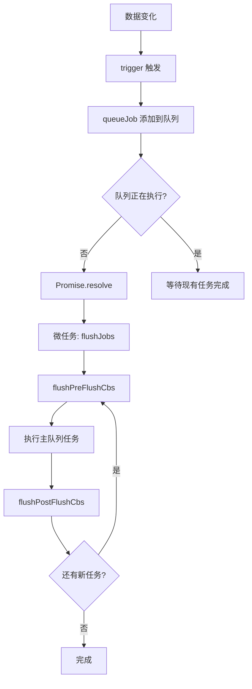
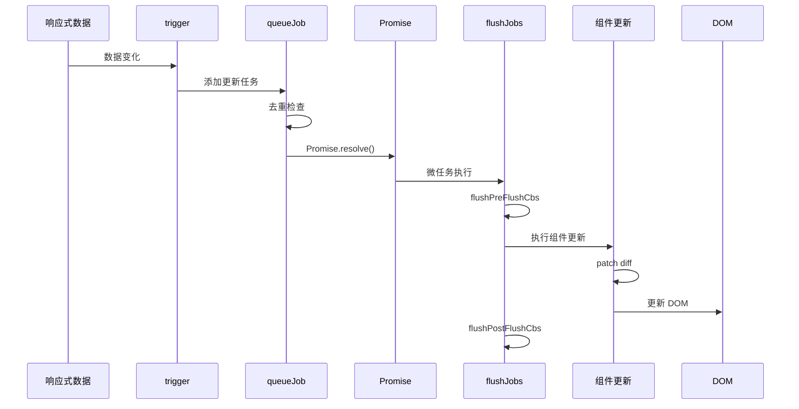

# 调度器详解

调度器（Scheduler）是 Vue 响应式系统的核心组件，负责控制副作用函数的执行时机，实现高效的批量更新。

## 调度器的作用

1. **批量更新**：将多次数据变更合并为一次更新
2. **异步执行**：在下一个微任务中执行更新
3. **优先级控制**：按优先级顺序执行任务
4. **去重优化**：避免重复执行相同任务

## 核心数据结构

```typescript
// packages/runtime-core/src/scheduler.ts

// 任务队列
const queue: Function[] = []
// 等待执行的 pre 队列（组件更新前）
const pendingPreFlushCbs: Function[] = []
// 当前正在执行的 pre 回调
let activePreFlushCbs: Function[] | null = null

// 调度器状态
let isFlushing = false   // 是否正在执行队列
let flushIndex = 0       // 当前执行位置
let pendingPostFlushCbs: Function[] = []  // post 回调队列

// 微任务控制
let currentFlushPromise: Promise<void> | null = null
```

## 任务队列机制

### queueJob - 组件更新调度

将组件更新任务加入队列：

```typescript
export function queueJob(job: Function) {
  // 1. 避免重复添加相同任务
  if (
    !queue.includes(job) &&
    !pendingPreFlushCbs.includes(job)
  ) {
    queue.push(job)
  }

  // 2. 如果队列未执行，开始执行
  if (!isFlushing) {
    isFlushing = true
    // 在下一个微任务中执行
    currentFlushPromise = Promise.resolve().then(flushJobs)
  }
}
```

### flushJobs - 执行队列任务

```typescript
function flushJobs() {
  // 1. 执行 pre 刷新回调
  flushPreFlushCbs()

  // 2. 执行主队列任务
  isFlushing = true
  for (flushIndex = 0; flushIndex < queue.length; flushIndex++) {
    const job = queue[flushIndex]
    job()
  }

  // 3. 执行 post 刷新回调
  flushPostFlushCbs()

  // 4. 检查是否需要再次执行（如有新增任务）
  if (
    queue.length ||
    pendingPreFlushCbs.length ||
    pendingPostFlushCbs.length
  ) {
    flushJobs()
  }

  isFlushing = false
}
```

## 执行流程图



## 队列优先级

Vue 调度器按以下优先级执行：

1. **pre 队列**：组件更新前的回调（如 beforeUpdate）
2. **主队列**：组件渲染更新
3. **post 队列**：组件更新后的回调（如 updated）

### 添加 pre 回调

```typescript
export function queuePreFlushCb(cb: Function) {
  queueFunction(cb, pendingPreFlushCbs)
}

function queueFunction(cb: Function, queue: Function[]) {
  if (!queue.includes(cb)) {
    queue.push(cb)
  }
  if (!isFlushing) {
    queueFlush()
  }
}
```

### 执行 pre 回调

```typescript
function flushPreFlushCbs() {
  if (pendingPreFlushCbs.length) {
    activePreFlushCbs = [...pendingPreFlushCbs]
    pendingPreFlushCbs.length = 0

    for (let i = 0; i < activePreFlushCbs.length; i++) {
      const cb = activePreFlushCbs[i]
      cb()
    }
    activePreFlushCbs = null
  }
}
```

## 任务去重机制

```typescript
// 检查任务是否已在队列中
export function queueJob(job: Function) {
  // 不允许重复添加
  if (
    !queue.includes(job) &&           // 不在主队列
    !pendingPreFlushCbs.includes(job) // 不在 pre 队列
  ) {
    queue.push(job)
  }
}
```

## 与响应式系统集成

### 组件更新调度

```typescript
// 组件更新使用调度器
const setupRenderEffect = (instance) => {
  const componentUpdateFn = () => {
    // 渲染逻辑
  }

  // 创建响应式副作用
  const effect = new ReactiveEffect(
    componentUpdateFn,
    () => queuePreFlushCb(update)  // 使用调度器
  )
}
```

### 响应式数据触发

```typescript
// 数据变化时触发
export function triggerEffect(effect) {
  if (effect.scheduler) {
    // 有调度器则使用调度器
    effect.scheduler()
  } else {
    // 没有调度器直接执行
    effect.run()
  }
}
```

## 执行时机

调度器使用 `Promise.resolve()` 在下一个微任务中执行，确保：

1. **DOM 更新后执行**：当前同步代码执行完毕，DOM 已更新
2. **批量处理**：同一事件循环中的多次变更只触发一次更新
3. **避免阻塞**：不会阻塞主线程

```typescript
// 实际执行流程
state.count++   // 同步代码，触发 trigger
state.name = 'new'  // 同步代码，触发 trigger

// 微任务队列
Promise.resolve().then(() => {
  flushJobs()  // 统一执行所有更新
})
```

## 完整调度流程



## 性能优化

### 1. 任务去重

相同任务不会重复添加到队列中。

### 2. 智能重跑

如果执行过程中有新任务加入，会继续执行。

```typescript
// 检查并处理新任务
if (queue.length || pendingPreFlushCbs.length || pendingPostFlushCbs.length) {
  flushJobs()  // 继续执行新任务
}
```

### 3. 分批处理

- **pre 回调**：DOM 更新前执行
- **主任务**：DOM 更新时执行
- **post 回调**：DOM 更新后执行

## 总结

Vue 调度器的核心设计：

1. **微任务执行**：使用 Promise 实现异步批处理
2. **三级队列**：pre → 主队列 → post
3. **去重机制**：避免重复执行
4. **响应式集成**：与 ReactiveEffect 深度集成
5. **高效渲染**：确保 DOM 更新性能
