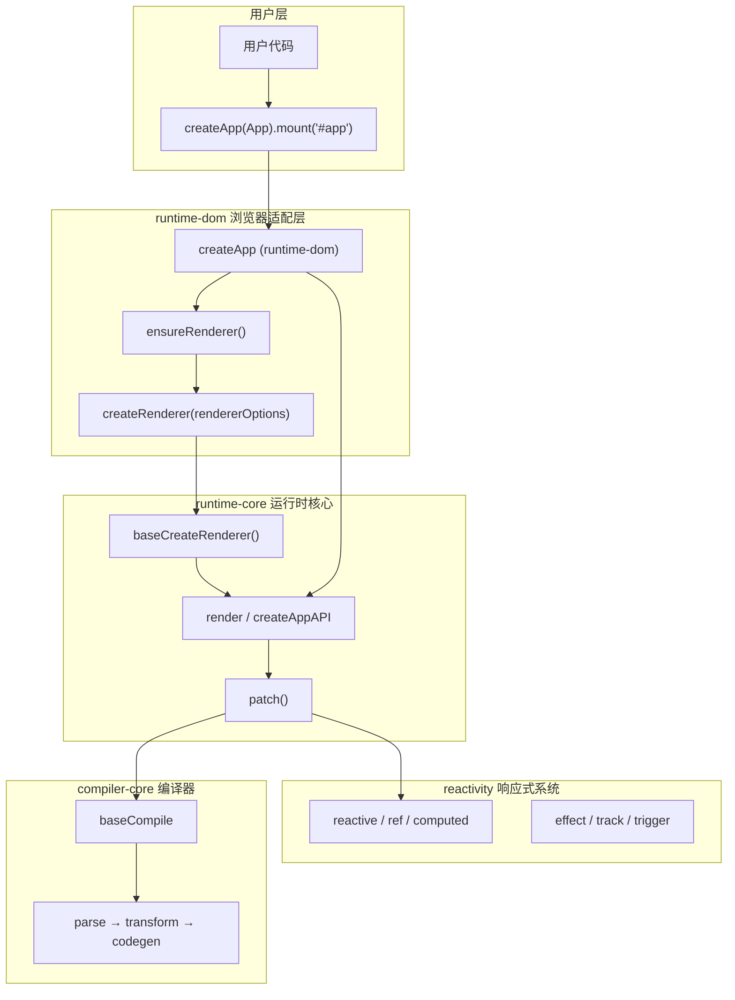
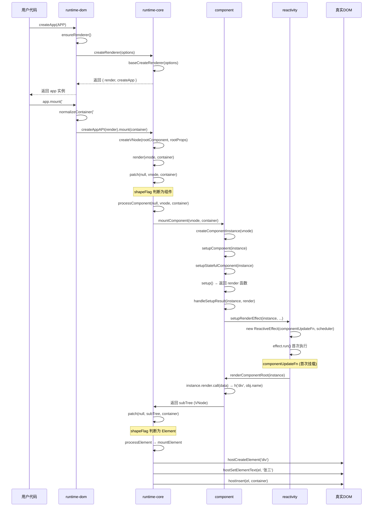
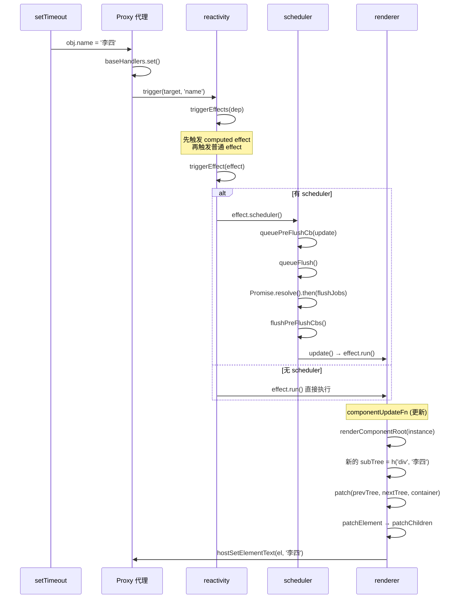
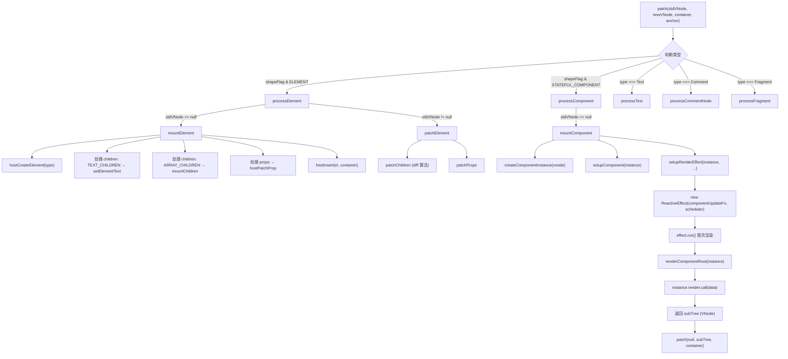
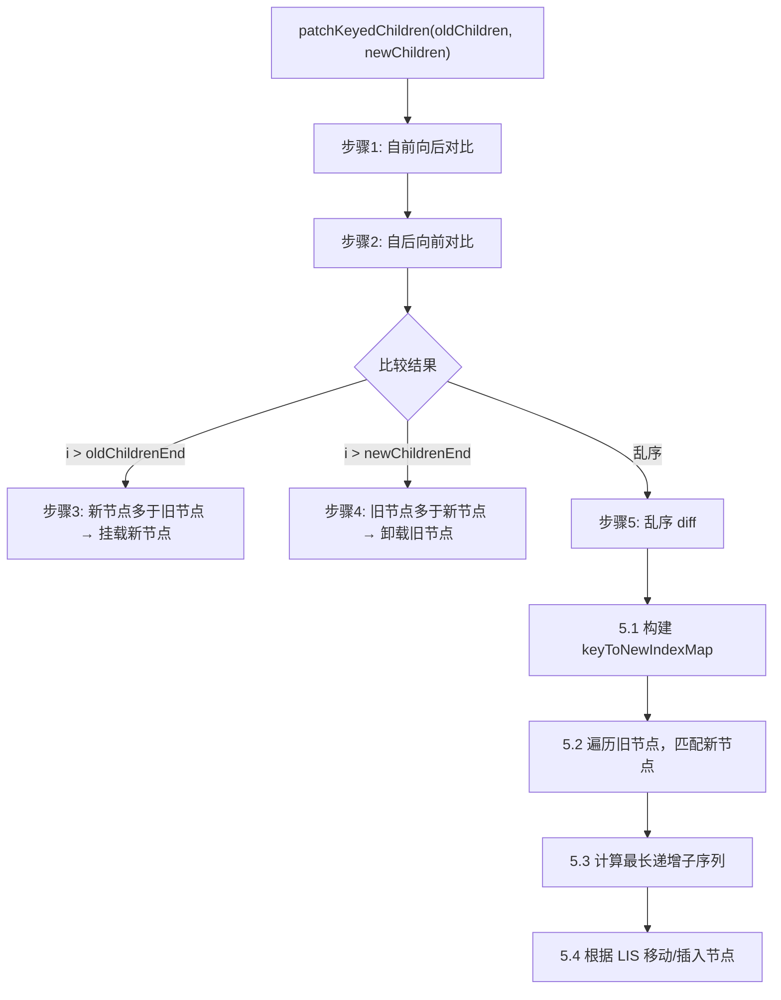
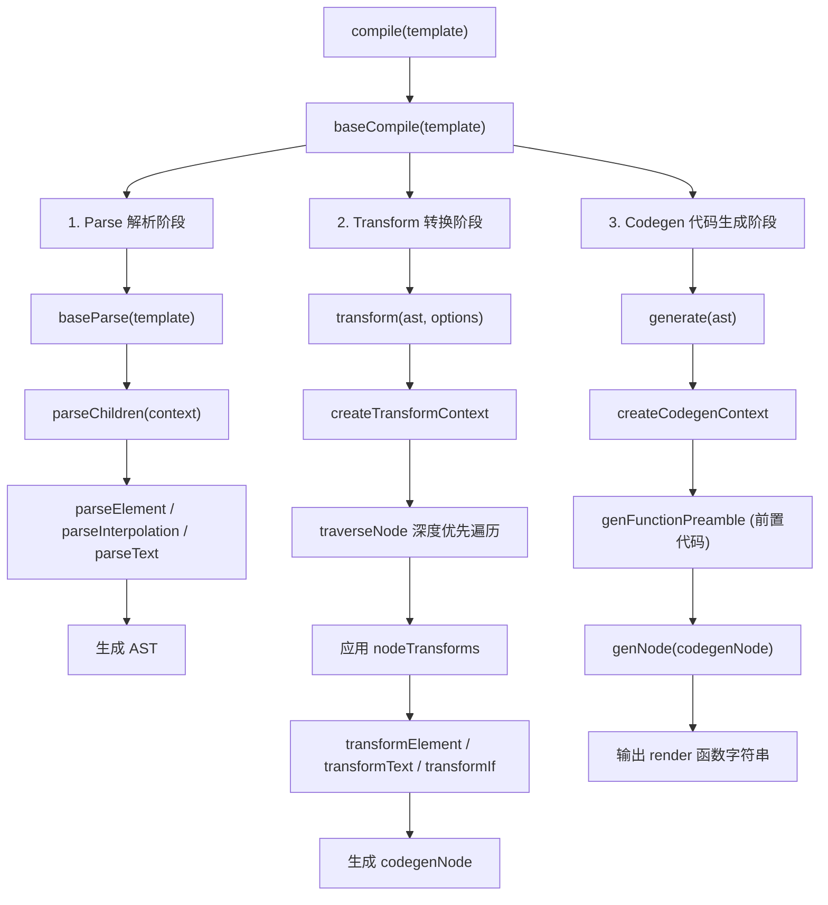
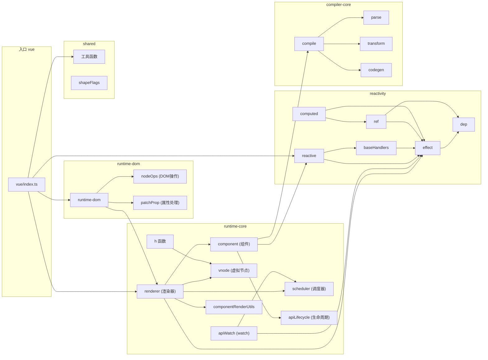

# Mini-Vue 完整调用链路

## 一、整体架构概览

---

## 二、初始化挂载链路（以 createApp-setup.html 为例）

---

## 三、响应式更新链路

---

## 四、核心模块详细链路

### 4.1 响应式系统 (`reactivity`)

```mermaid
graph TD
    subgraph "reactive 响应式对象"
        A["reactive(target)"] --> B["createReactiveObject(target, mutableHandlers)"]
        B --> C["new Proxy(target, { get, set })"]
        C --> D["get: track(target, key) 收集依赖"]
        C --> E["set: trigger(target, key) 触发依赖"]
    end
    
    subgraph "ref 响应式引用"
        F["ref(value)"] --> G["new RefImpl(value)"]
        G --> H["get value: trackRefValue(this)"]
        G --> I["set value: triggerRefValue(this)"]
    end
    
    subgraph "computed 计算属性"
        J["computed(getter)"] --> K["new ComputedRefImpl(getter)"]
        K --> L["new ReactiveEffect(getter, scheduler)"]
        L --> M["get value: 脏检查 + 缓存"]
        M --> N["_dirty=true → effect.run() 重新计算"]
        M --> O["_dirty=false → 返回缓存值"]
    end
    
    subgraph "effect 副作用"
        P["ReactiveEffect"] --> Q["fn: 副作用函数"]
        P --> R["scheduler: 调度器"]
        P --> S["run(): activeEffect=this → fn()"]
    end
    
    subgraph "依赖收集与触发"
        T["track(target, key)"] --> U["targetMap.get(target).get(key) → dep"]
        U --> V["dep.add(activeEffect)"]
        W["trigger(target, key)"] --> X["targetMap.get(target).get(key) → dep"]
        X --> Y["遍历 dep 触发 effect"]
        Y --> Z["先 computed effect → 再普通 effect"]
    end
```

### 4.2 渲染器 (`renderer`)

### 4.3 Diff 算法链路

### 4.4 编译器链路 (`compiler`)

---

## 五、完整生命周期链路

```mermaid
graph TD
    A["createApp(Component)"] --> B["app.mount('#app')"]
    B --> C["createVNode(Component)"]
    C --> D["render(vnode, container) → patch()"]
    D --> E["processComponent → mountComponent"]
    
    E --> F["createComponentInstance(vnode)"]
    F --> G["setupComponent(instance)"]
    
    G --> H["setupStatefulComponent"]
    H --> I["setup() 执行"]
    I --> J["handleSetupResult → instance.render = setupResult"]
    
    J --> K["finishComponentSetup"]
    K --> L["applyOptions(instance)"]
    L --> L1["beforeCreate 钩子"]
    L1 --> L2["data() → reactive(data)"]
    L2 --> L3["created 钩子"]
    L3 --> L4["注册 onBeforeMount / onMounted"]
    
    L4 --> M["setupRenderEffect(instance)"]
    M --> N["new ReactiveEffect(componentUpdateFn, scheduler)"]
    N --> O["effect.run() 首次执行"]
    
    O --> P["beforeMount 钩子 (bm)"]
    P --> Q["renderComponentRoot → instance.render()"]
    Q --> R["patch(null, subTree, container)"]
    R --> S["mounted 钩子 (m)"]
    S --> T["instance.isMounted = true"]
    
    T -.->|"响应式数据变化"| U["trigger → scheduler → queuePreFlushCb"]
    U --> V["Promise.resolve().then(flushJobs)"]
    V --> W["update() → effect.run()"]
    W --> X["renderComponentRoot → 新 subTree"]
    X --> Y["patch(prevTree, nextTree)"]
    Y --> Z["DOM 更新完成"]
```

---

## 六、模块间依赖关系

---

## 七、关键数据结构流转

| 阶段 | 数据 | 说明 |
|------|------|------|
| 用户输入 | `Component { setup() }` | 组件定义对象 |
| createVNode | `VNode { type, props, children, shapeFlag }` | 虚拟节点 |
| mountComponent | `ComponentInstance { uid, vnode, render, effect, update }` | 组件实例 |
| setup() | `render 函数` 或 `状态对象` | setup 返回值 |
| render() | `subTree (VNode)` | 组件渲染输出的虚拟 DOM 树 |
| patch() | `真实 DOM 操作` | 将 VNode 映射为真实 DOM |
| reactive() | `Proxy { get→track, set→trigger }` | 响应式代理对象 |
| effect | `ReactiveEffect { fn, scheduler }` | 副作用实例 |
| 依赖收集 | `targetMap: WeakMap<target, Map<key, Dep>>` | 全局依赖映射 |
| 调度更新 | `pendingPreFlushCbs[] → Promise.then(flushJobs)` | 微任务队列 |

---

## 八、一句话总结核心流程

> **`createApp(Component).mount('#app')`** → 创建渲染器 → `createVNode` 构建虚拟节点 → `patch` 分发到 `processComponent` → `mountComponent` 创建组件实例 → 执行 `setup()` 获取 render 函数 → `setupRenderEffect` 创建响应式副作用 → `ReactiveEffect.run()` 执行 `componentUpdateFn` → `renderComponentRoot` 调用 render 得到 subTree → `patch(null, subTree)` 递归渲染为真实 DOM → 数据变化时 `trigger` → `scheduler` 入队 → 微任务执行 `update()` → 新旧 subTree diff → 最小化 DOM 更新。
