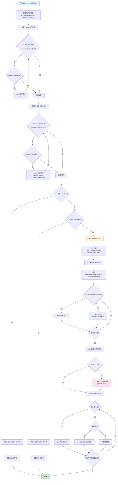

# 运行时核心（runtime-core）

`runtime-core` 模块是 mini-vue 的运行时核心，负责虚拟 DOM、组件系统、渲染器等的实现。

## 主要内容

- **虚拟 DOM（VNode）**：通过 vnode.ts 定义虚拟节点结构，实现高效的 DOM diff。
- **组件系统**：component.ts 实现组件的创建、挂载、更新和卸载。
- **渲染器（renderer）**：renderer.ts 实现平台无关的渲染逻辑，支持自定义渲染目标。
- **调度与副作用**：scheduler.ts 管理副作用任务的调度。

## 主要 API

- `h(type, props, children)`：创建虚拟节点。
- `createRenderer(options)`：创建自定义渲染器。
- `render(vnode, container)`：渲染虚拟节点到容器。

## 示例

```js
import { h, render } from 'mini-vue/runtime-core'

const vnode = h('div', { id: 'app' }, 'Hello mini-vue')
render(vnode, document.getElementById('root'))
```

更多运行时相关示例可参考 `packages/vue/src/examples/runtime/` 目录。 


## Vue3 Diff算法流程解析

### 🎯 算法总体思路
Vue3的diff算法采用了**双端比较 + 最长递增子序列**的策略，将复杂度从O(n³)优化到O(n log n)。

### 📋 五大核心步骤

#### **步骤1: 自前向后对比**
- 从数组开头开始，逐一对比新旧节点
- 相同类型的节点直接patch更新
- 遇到不同类型立即跳出循环

#### **步骤2: 自后向前对比**  
- 从数组末尾开始，逐一对比新旧节点
- 继续处理相同类型的节点
- 这两步可以快速处理大多数常见场景

#### **步骤3: 新节点多于旧节点**
- 如果`i > oldChildrenEnd`，说明还有新节点需要挂载
- 确定正确的插入位置（锚点）
- 挂载所有剩余的新节点

#### **步骤4: 旧节点多于新节点**
- 如果`i > newChildrenEnd`，说明还有旧节点需要删除
- 卸载所有剩余的旧节点

#### **步骤5: 乱序情况（最复杂）**
这是算法的精华部分，分为三个子步骤：

**5.1 建立映射关系**
- 创建`keyToNewIndexMap`：key → 新数组索引的映射
- 这就是为什么v-for需要key的原因！

**5.2 处理旧节点**
- 遍历所有旧节点，尝试在新数组中找到对应位置
- 建立`newIndexToOldIndexMap`：新索引 → 旧索引的映射
- 判断节点是否需要移动（通过最大索引值递增判断）

**5.3 最小化移动操作**
- 使用**最长递增子序列算法**找出不需要移动的节点
- 只移动不在子序列中的节点，大大减少DOM操作

### 🚀 算法优势

1. **性能优化**：通过双端比较快速处理常见场景
2. **移动最小化**：最长递增子序列算法最小化DOM移动
3. **内存友好**：使用索引映射而非直接操作DOM
4. **稳定性高**：对各种边界情况都有完善处理

### 流程图

