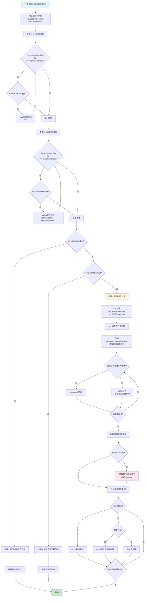

# Vue3 运行时核心原理详解

Vue3 的运行时核心是整个框架的执行引擎，负责虚拟 DOM、组件系统、渲染器等核心功能的实现。它与编译器协同工作，将编译后的渲染函数转换为真实的 DOM 操作。

## 核心概念

### 1. 虚拟 DOM（Virtual DOM）
虚拟 DOM 是真实 DOM 的轻量级 JavaScript 对象表示。它通过抽象的方式描述 UI 结构，使得框架可以在内存中进行高效的 diff 操作，最小化真实的 DOM 操作。

### 2. 渲染器（Renderer）
渲染器是运行时的核心组件，负责将虚拟 DOM 渲染到目标环境（如浏览器 DOM、移动端原生控件等）。它实现了平台无关的渲染逻辑，通过配置选项适配不同的渲染目标。

### 3. 组件系统
Vue3 的组件系统实现了组件的创建、挂载、更新和卸载等生命周期管理。每个组件都有自己的状态、属性和生命周期钩子。

## 虚拟 DOM 实现

### VNode 结构
虚拟节点（VNode）是虚拟 DOM 的基本单位，包含以下核心属性：

```typescript
interface VNode {
  __v_isVNode: true   // 标识这是一个 VNode
  type: any           // 节点类型（标签名、组件、Fragment 等）
  props: any          // 节点属性
  children: any       // 子节点
  shapeFlag: number   // 节点类型标记（使用位运算）
  key: any            // 节点唯一标识
  el: any             // 对应的真实 DOM 元素
  component: any      // 组件实例（如果是组件节点）
}
```

### ShapeFlags 位运算标记
Vue3 使用位运算来高效地表示和检查节点类型：

```typescript
export const enum ShapeFlags {
  ELEMENT = 1,                    // 普通元素
  FUNCTIONAL_COMPONENT = 1 << 1,  // 函数组件
  STATEFUL_COMPONENT = 1 << 2,    // 有状态组件
  TEXT_CHILDREN = 1 << 3,         // 文本子节点
  ARRAY_CHILDREN = 1 << 4,        // 数组子节点
  SLOTS_CHILDREN = 1 << 5,        // 插槽子节点
  COMPONENT = ShapeFlags.STATEFUL_COMPONENT | ShapeFlags.FUNCTIONAL_COMPONENT
}
```

### VNode 创建
```javascript
// 创建元素节点
function createVNode(type, props, children) {
  const shapeFlag = isString(type)
    ? ShapeFlags.ELEMENT
    : isObject(type)
    ? ShapeFlags.STATEFUL_COMPONENT
    : 0
    
  return {
    __v_isVNode: true,
    type,
    props,
    shapeFlag,
    key: props?.key || null,
    children
  }
}
```

## 渲染器实现

### 渲染器架构
渲染器采用平台适配的设计模式，通过配置选项定义平台相关操作：

```typescript
interface RendererOptions {
  createElement(type: string)        // 创建元素
  patchProp(el, key, prev, next)     // 更新属性
  insert(el, parent, anchor)         // 插入元素
  remove(el)                         // 删除元素
  setElementText(el, text)           // 设置元素文本
  createText(text)                   // 创建文本节点
  setText(node, text)                // 更新文本节点
  createComment(text)                // 创建注释节点
}
```

### Patch 算法
渲染器的核心是 patch 算法，它负责对比新旧 VNode 并更新真实 DOM：

```javascript
function patch(oldVNode, newVNode, container, anchor) {
  // 类型不同直接替换
  if (oldVNode && !isSameVNodeType(oldVNode, newVNode)) {
    unmount(oldVNode)
    oldVNode = null
  }
  
  const { type, shapeFlag } = newVNode
  switch (type) {
    case Text:
      processText(oldVNode, newVNode, container, anchor)
      break
    case Comment:
      processCommentNode(oldVNode, newVNode, container, anchor)
      break
    case Fragment:
      processFragment(oldVNode, newVNode, container, anchor)
      break
    default:
      if (shapeFlag & ShapeFlags.ELEMENT) {
        processElement(oldVNode, newVNode, container, anchor)
      } else if (shapeFlag & ShapeFlags.COMPONENT) {
        processComponent(oldVNode, newVNode, container, anchor)
      }
  }
}
```

## Diff 算法详解

Vue3 采用了优化的双端 diff 算法，将复杂度从 O(n³) 优化到 O(n)。

### 算法流程

#### 1. 自前向后对比
从数组开头开始，逐一对比新旧节点，相同类型的节点直接 patch 更新。

#### 2. 自后向前对比
从数组末尾开始，继续处理相同类型的节点。

#### 3. 处理新增/删除节点
```javascript
// 新节点多于旧节点
if (i > oldChildrenEnd) {
  if (i <= newChildrenEnd) {
    const nextPos = newChildrenEnd + 1
    const anchor = nextPos < newChildrenLength ? newChildren[nextPos].el : parentAnchor
    while (i <= newChildrenEnd) {
      patch(null, normalizeVNode(newChildren[i]), container, anchor)
      i++
    }
  }
}

// 旧节点多于新节点
else if (i > newChildrenEnd) {
  while (i <= oldChildrenEnd) {
    unmount(oldChildren[i])
    i++
  }
}
```

#### 4. 处理乱序节点
这是算法最复杂的部分，使用了最长递增子序列（LIS）算法来最小化 DOM 移动操作：

```javascript
// 创建 key 到索引的映射
const keyToNewIndexMap = new Map()
for (i = newStartIndex; i <= newChildrenEnd; i++) {
  const nextChild = normalizeVNode(newChildren[i])
  if (nextChild.key != null) {
    keyToNewIndexMap.set(nextChild.key, i)
  }
}

// 建立新旧索引映射
const newIndexToOldIndexMap = new Array(toBePatched)
for (i = 0; i < toBePatched; i++) newIndexToOldIndexMap[i] = 0

// 遍历旧节点，进行 patch 或 unmount
for (i = oldStartIndex; i <= oldChildrenEnd; i++) {
  const prevChild = oldChildren[i]
  let newIndex
  if (prevChild.key != null) {
    newIndex = keyToNewIndexMap.get(prevChild.key)
  } else {
    // 没有 key 时遍历查找
    for (j = newStartIndex; j <= newChildrenEnd; j++) {
      if (
        newIndexToOldIndexMap[j - newStartIndex] === 0 &&
        isSameVNodeType(prevChild, newChildren[j])
      ) {
        newIndex = j
        break
      }
    }
  }
  
  if (newIndex === undefined) {
    unmount(prevChild)
  } else {
    // 建立映射关系
    newIndexToOldIndexMap[newIndex - newStartIndex] = i + 1
    patch(prevChild, newChildren[newIndex], container, null)
  }
}

// 使用最长递增子序列优化移动操作
const increasingNewIndexSequence = moved
  ? getSequence(newIndexToOldIndexMap)
  : []
j = increasingNewIndexSequence.length - 1

// 从后向前处理，避免频繁的 DOM 操作
for (i = toBePatched - 1; i >= 0; i--) {
  const nextIndex = newStartIndex + i
  const nextChild = newChildren[nextIndex]
  const anchor =
    nextIndex + 1 < newChildrenLength
      ? newChildren[nextIndex + 1].el
      : parentAnchor
      
  if (newIndexToOldIndexMap[i] === 0) {
    // 新增节点
    patch(null, nextChild, container, anchor)
  } else if (moved) {
    // 需要移动的节点
    if (j < 0 || i !== increasingNewIndexSequence[j]) {
      move(nextChild, container, anchor)
    } else {
      j--
    }
  }
}
```

## 组件系统实现

### 组件实例
每个组件都有一个实例对象，包含组件的所有状态和方法：

```javascript
function createComponentInstance(vnode) {
  const instance = {
    vnode,
    type: vnode.type,
    props: null,
    setupState: EMPTY_OBJ,
    ctx: EMPTY_OBJ,
    refs: EMPTY_OBJ,
    data: EMPTY_OBJ,
    render: null,
    subTree: null,
    isMounted: false,
    update: null,
    effect: null,
    // 生命周期钩子
    bm: null,  // beforeMount
    m: null,   // mounted
    // ... 更多属性
  }
  return instance
}
```

### 组件挂载
组件挂载过程包括实例创建、setup 执行、首次渲染等步骤：

```javascript
function mountComponent(initialVNode, container, anchor) {
  // 创建组件实例
  initialVNode.component = createComponentInstance(initialVNode)
  const instance = initialVNode.component
  
  // 标准化组件实例数据
  setupComponent(instance)
  
  // 设置组件渲染副作用
  setupRenderEffect(instance, initialVNode, container, anchor)
}

function setupRenderEffect(instance, initialVNode, container, anchor) {
  const componentUpdateFn = () => {
    if (!instance.isMounted) {
      // 挂载阶段
      const { bm, m } = instance
      // 执行 beforeMount 钩子
      if (bm) bm()
      
      // 渲染组件内容
      const subTree = (instance.subTree = renderComponentRoot(instance))
      patch(null, subTree, container, anchor)
      
      // 执行 mounted 钩子
      if (m) m()
      
      // 设置组件根元素
      initialVNode.el = subTree.el
      instance.isMounted = true
    } else {
      // 更新阶段
      const nextTree = renderComponentRoot(instance)
      const prevTree = instance.subTree
      instance.subTree = nextTree
      
      // diff 更新
      patch(prevTree, nextTree, container, anchor)
      nextTree.el = nextTree.el
    }
  }
  
  // 创建响应式副作用
  const effect = (instance.effect = new ReactiveEffect(
    componentUpdateFn,
    () => queuePreFlushCb(update) // 调度器
  ))
  
  const update = (instance.update = () => effect.run())
  update()
}
```

## 响应式更新机制

Vue3 运行时与响应式系统深度集成，通过副作用函数实现组件的自动更新：

```javascript
// 组件渲染副作用与响应式系统的结合
const setupRenderEffect = (instance) => {
  const componentUpdateFn = () => {
    // 组件渲染逻辑
    const subTree = renderComponentRoot(instance)
    patch(null, subTree, container, anchor)
  }
  
  // 响应式副作用，当组件依赖的响应式数据变化时自动触发更新
  const effect = new ReactiveEffect(
    componentUpdateFn,
    () => queueJob(update) // 调度器，控制更新时机
  )
  
  const update = () => effect.run()
  update()
}
```

当组件中使用的响应式数据发生变化时，会自动触发对应的副作用函数重新执行，从而实现组件的自动更新。

### 流程图



## 调度系统

Vue3 的调度系统负责控制副作用函数的执行时机，实现批量更新和性能优化：

```javascript
// 调度器实现
const queue = []
let isFlushing = false

function queueJob(job) {
  if (!queue.includes(job)) {
    queue.push(job)
    if (!isFlushing) {
      isFlushing = true
      // 在下一个微任务中执行所有队列中的任务
      Promise.resolve().then(flushJobs)
    }
  }
}

function flushJobs() {
  for (let i = 0; i < queue.length; i++) {
    queue[i]()
  }
  queue.length = 0
  isFlushing = false
}
```

## 总结

Vue3 运行时核心通过虚拟 DOM、渲染器、组件系统等核心组件，实现了高效的 UI 渲染和更新。其与响应式系统的深度集成，使得开发者可以以声明式的方式编写 UI，而框架会在背后自动处理复杂的 DOM 操作和更新优化。理解运行时核心的原理有助于开发者更好地使用 Vue3，也能在遇到性能问题时进行针对性优化。